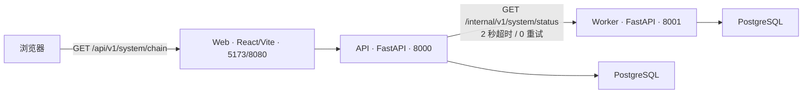

# FlowVerse（流界）

FlowVerse V1 是一个面向长篇小说创作与真实运营闭环的多模型、多 Agent 工作台。当前仓库完成的是 V1 的非业务架构版：三个独立代码服务、运行与质量基线、真实依赖诊断、本地原生测试入口和独立的服务器中间件配置已经具备；认证、创作、发布、反馈、分析等正式业务尚未实现。

## 当前可运行架构



Web 提供简体中文架构检查页；API 聚合自身和 Worker 状态；API、Worker 分别执行有界 PostgreSQL 探针。未配置数据库时，页面仍能打开并如实显示降级，不会伪造成功。

## 目录与包

| 路径 | 所有权与内容 |
|---|---|
| `services/web` | 检查页、Vite 开发代理、Vitest 测试、Nginx 生产镜像 |
| `services/api` | 公共健康/链路接口、API PostgreSQL 探针、Worker 客户端、Alembic 空基线 |
| `services/worker` | 常驻内部状态服务、Worker PostgreSQL 探针、兼容的一次性 `--check` |
| `scripts` | 本地原生启动、模块边界/循环依赖检查及其自测 |
| `deploy/local` | 当前本地测试部署入口和使用说明，不使用 Docker |
| `deploy/server/middleware` | 服务器 PostgreSQL、Redis、MinIO Compose 配置；不包含应用服务或密码 |
| `docs/product` / `docs/uiux` | 已批准的 PRD v1.1 产品与 UIUX 摘要 |
| `docs/engineering` | 技术栈、架构、可靠性、性能、编码流程和技术债登记 |
| `docs/decisions` | ADR 决策记录；ADR-0006 管理本地测试入口，ADR-0007 管理服务器中间件，ADR-0008 管理 PostgreSQL 扩展组合 |

业务模块边界已经声明但没有业务实现：API 拥有身份权限、任务生命周期、创作资料、创作内容、Review/合规、发布/Cycle、反馈/决策和治理运维；Worker 独立拥有 AI execution。服务之间禁止直接导入源码，模块跨边界只能通过 `public` 入口。

### 为什么有 `services/api/src/flowverse_api`

`services/api` 是可独立安装、测试和部署的服务工程；`src` 是 Python 的源码隔离层；`flowverse_api` 是安装后稳定的 Python 导入命名空间；它里面的 `api` 才是 FastAPI HTTP 适配层。这个标准 `src layout` 可以阻止项目根目录被偶然导入，确保本地测试与安装/容器运行使用同一套导入行为。Worker 使用同样结构和独立命名空间 `flowverse_worker`。

## 主要版本

| 区域 | 版本 |
|---|---|
| Python / uv | CPython 3.13.14 / uv 0.11.28 |
| API 与 Worker | FastAPI 0.139.0 / Uvicorn 0.51.0 |
| 数据访问 | PostgreSQL 18.4 目标；SQLAlchemy 2.0.51 / Alembic 1.18.5 / psycopg 3.3.4 |
| 服务器缓存能力 | Redis Open Source 8.8.0；支持本地认证诊断，尚未接入业务缓存/队列 |
| 向量能力 | pgvector 0.8.5，构建在 PostgreSQL 镜像中；不会自动建扩展或表 |
| 时间序列能力 | TimescaleDB 2.28.3 OSS，构建在同一 PostgreSQL 镜像中；不会自动建扩展、hypertable 或策略 |
| 对象存储能力 | MinIO `RELEASE.2025-10-15T17-29-55Z` 源码构建；支持本地认证诊断，尚未创建业务用户或桶 |
| Web 运行时 | Node.js 24.17.0 / pnpm 11.10.0 |
| Web | React 19.2.7 / Vite 8.1.4 / TypeScript 5.9.3 |
| Web 质量 | ESLint 10.6.0 / Prettier 3.9.5 / Vitest 4.1.9 |
| Python 质量 | Ruff 0.15.20 / Pyright 1.1.411 / pytest 9.1.1 |
| 可观测性 | structlog 26.1.0 / OpenTelemetry 1.43.0（当前无 exporter） |

精确直接依赖和命令状态以 [`docs/engineering/TECH_STACK.md`](docs/engineering/TECH_STACK.md) 为准。

## 本地准备

本地运行不使用 Docker。需要提前安装：

- Python 3.13.14 与 uv 0.11.28；
- Node.js 24.17.0（必须使用该版本）和 Corepack；
- PostgreSQL 18.4，或者一个兼容且由你独立提供的 PostgreSQL 实例。

安装锁定依赖：

```powershell
uv sync --project services/api --python 3.13.14
uv sync --project services/worker --python 3.13.14
corepack pnpm@11.10.0 --dir services/web install --frozen-lockfile
```

复制环境模板并只修改本地值：

```powershell
Copy-Item .env.example .env
```

必须把 `.env` 中的连接占位符改为真实本地连接。脚本不会打印环境值，也不会覆盖当前进程中已经设置的变量。正常 API/Worker 架构链仍只以 PostgreSQL 为状态依赖；独立 `middleware-check` 可认证检查 Redis 和 MinIO，但不构成业务缓存、队列或对象存储接入。

如果本地开发需要使用已部署在服务器上的中间件，不要开放中间件公网端口。先在一个 PowerShell 窗口运行 [`deploy/local/start-middleware-tunnel.ps1`](deploy/local/start-middleware-tunnel.ps1)，它会通过 SSH 将服务器私有端口映射到本机 `127.0.0.1:15432/16379/19000/19001`；再在另一个窗口运行 [`deploy/local/configure-middleware.ps1`](deploy/local/configure-middleware.ps1)，安全写入本地 `.env` 并认证检查三项服务。完整命令见 [`deploy/local/README.md`](deploy/local/README.md)。

## 启动和验证

先检查运行时：

```powershell
powershell -ExecutionPolicy Bypass -File deploy/local/start.ps1 preflight
```

一条命令启动三服务：

```powershell
powershell -ExecutionPolicy Bypass -File deploy/local/start.ps1
```

脚本会隐藏启动 API 和 Worker、等待二者存活，再以前台方式启动 Web。按 `Ctrl+C` 退出时只清理本次启动的子进程。打开：

- 检查页：`http://127.0.0.1:5173/`
- 完整链路：`http://127.0.0.1:8000/api/v1/system/chain`
- API 存活：`http://127.0.0.1:8000/health/live`
- API 就绪：`http://127.0.0.1:8000/health/ready`
- Worker 存活：`http://127.0.0.1:8001/health/live`
- Worker 内部状态：`http://127.0.0.1:8001/internal/v1/system/status`

也可以向 `deploy/local/start.ps1` 传入 `api`、`worker`、`web`、`worker-check` 或 `all`。只有 API、Worker 和双方 PostgreSQL 探针都可用时，完整链路返回 200；缺少数据库配置时返回 503 是预期、真实的降级结果。

## 质量检查

仓库定义了 Web lint/format/typecheck/test/build、两个 Python 服务的 Ruff/Pyright/pytest，以及架构检查与架构检查器自测。精确命令都登记在技术栈文档中。最小架构检查为：

```powershell
python scripts/check_architecture.py
python -m unittest scripts.test_check_architecture
```

## 部署边界

本地应用测试入口是 [`deploy/local/start.ps1`](deploy/local/start.ps1)，只用于 Windows 本地架构测试。它复用 `scripts/start-local.ps1` 的服务编排，不复制第二套启动逻辑，也不使用 Docker、云效或其他云端服务。

服务器中间件入口是 [`deploy/server/middleware/compose.yml`](deploy/server/middleware/compose.yml)，仍然只创建 PostgreSQL、Redis 和 MinIO 三个容器。PostgreSQL 18.4 镜像同时准备 pgvector 0.8.5 与 TimescaleDB 2.28.3 OSS，但不会自动执行 `CREATE EXTENSION` 或创建业务表。两个自定义镜像的构建定义已内嵌在 Compose 中；在仓库根目录执行 `bash deploy/server/middleware/start.sh` 即可安全生成缺失的本地密钥、构建、启动并等待健康。CPU/内存限制、磁盘容量计划和人工运维步骤见该目录的 [`README.md`](deploy/server/middleware/README.md)。这条路径不会启动 Web、API 或 Worker，也不会改变本地原生启动。

2026-07-23 的目标服务器单次部署验证中，修正后的 PostgreSQL 与 MinIO 镜像完成构建，PostgreSQL、Redis、MinIO 均达到 Docker `healthy` 状态。该结果只证明一次架构部署烟测，不代表扩展已创建、业务已经接入或生产可靠性已经验收。

仓库仍未选定 CI/CD、应用测试服务器或应用生产部署目标。三个应用服务的 Dockerfile 只作为未激活的独立打包入口保留。服务器中间件 Compose 是单机准备能力，不代表高可用、备份恢复、监控、TLS 或生产验收已经完成。

## 架构版之外

以下内容没有被“架构版完成”伪装为已实现：正式认证授权、任务/创作/Review/Cycle 业务、业务表结构、AI Provider 与任务队列、Redis/对象存储的业务接入、生产监控 exporter、备份恢复、CI/CD、应用测试服务器、应用生产部署和产品验收。实施这些内容前，继续遵循批准范围和 [`docs/engineering/AI_CODING_WORKFLOW.md`](docs/engineering/AI_CODING_WORKFLOW.md)。
