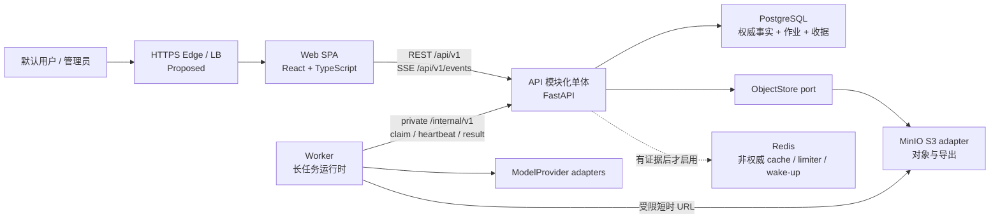
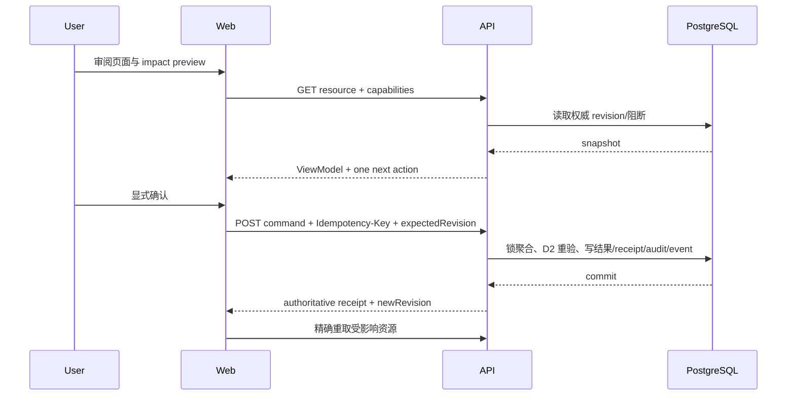
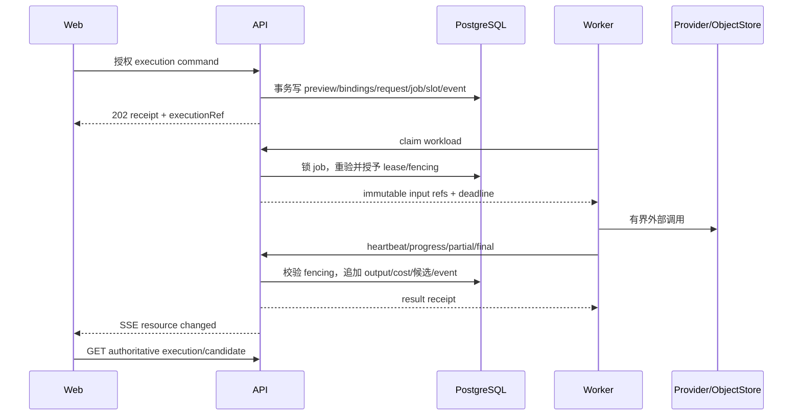
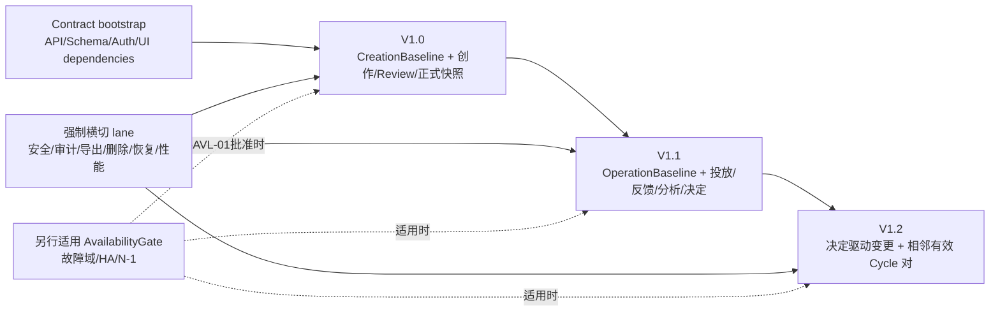

# FlowVerse V1 整体技术详细设计（评审稿）

## 0. 文档状态与使用边界

**状态：`IN_REVIEW / PROPOSED`。**

本文把已评审的高层技术方案下钻为可拆任务、可形成 DDL/OpenAPI、可验证和可回退的详细设计。它不等于实现授权，也不把 Proposed API、Schema、认证、依赖或生产拓扑写成已经批准或已经实现。

- 当前外部产品证据仍是未修改的 PRD v1.1 与 FlowVerse Phase 1 UIUX MVP receipt。
- V1.0、V1.1、V1.2 的精确分版、本文业务技术合同和 Proposed ADR 必须作为 `FV1-ROADMAP-REVIEW` 的同一变更集接受最终人类批准。
- 已确认的非业务 Bootstrap 运行时和直接依赖只从 [TECH_STACK.md](TECH_STACK.md) 读取；本文不成为版本注册表。
- 实现前必须把本文涉及的新增依赖、API、Schema、认证、安全、部署和预算转成 Accepted ADR、Confirmed target 与可执行验证门。
- 本文不修改 `services/**`、部署配置、数据库或外部 PRD/UIUX，不声称业务测试、Prompt 效果、UIUX、HA、恢复或性能已经通过。

详细设计包由四份同级文档组成：

1. 本文：范围、总体架构、关键流程、跨册不变量、实施与验收总索引。
2. [三服务、中间件与运维设计](V1_SERVICE_MIDDLEWARE_AND_OPERATIONS_DESIGN.md)：服务栈、进程边界、PG/Redis/MinIO、部署、HA、性能、可观测性、恢复。
3. [数据与接口合同设计](V1_DATA_AND_INTERFACE_CONTRACT_DESIGN.md)：逻辑表结构、约束、索引、REST/SSE、内部 Worker、对象上传和 AI binding 合同。
4. [前端技术设计](V1_FRONTEND_TECHNICAL_DESIGN.md)：路由、feature 边界、状态、表单/编辑器、REST/SSE 客户端、响应式、安全、性能与测试。

权威关系是：产品/AC/UIUX 定义业务含义和可见行为；本文定义跨册架构；三份专项设计分别拥有运行、数据/协议和前端实现细节；最终 DDL、OpenAPI 与代码必须从批准后的专项合同产生，禁止从截图或数据库表反推业务状态机。

## 1. 目标、范围与非目标

### 1.1 设计目标

本设计必须同时满足：

- 用同一套 Web、API、Worker 底座累计交付 V1.0 小说创作、V1.1 内容分析/运营复盘、V1.2 决策驱动的闭环效果验证。
- 把候选、正式事实、人类决定、配置、执行、费用、证据和审计分开保存并可追溯。
- 普通交互满足已确认的 P95 不超过 2 秒目标；长 AI、文件处理和导出脱离浏览器请求生命周期。
- 生产方向支持单区域多故障域、单写权威、可切换、可恢复和 N-1 容量，但在拓扑与测试未批准前不宣称高可用。
- PostgreSQL、Redis、MinIO 的当前能力可被清晰使用和替换；领域合同不暴露供应商地址、bucket/key、Redis key 或 ORM 实体。
- Prompt 效果通过三类 binding、评测、确定性校验、人审、激活和回退保障，而不是让模型成为状态机或最终裁决者。
- 为 V2 金融保留平台级稳定合同，不在 V1 预建金融表、路由、状态机、向量索引、时序表、交易或回测引擎。

### 1.2 当前规模假设

| 维度 | 已确认或受控边界 | 设计影响 |
|---|---|---|
| 用户 | 一个默认用户、一个管理员 | 不预建组织/租户、SSO 或复杂 RBAC；仍保留严格 user/admin 隔离 |
| AI 并发 | 每用户一个付费槽位、每任务一个业务步骤、步骤内最多三个模型 | PostgreSQL 耐久作业与有界 fan-out 足够；不引入消息代理 |
| 验证单元 | 一个真实小说任务、一个真实目标平台、首个相邻有效 Cycle 对 N/N+1 | task 是数据隔离和恢复边界；Cycle 编号永久递增且不重排 |
| 设备 | 桌面为主，390×844 的复杂业务只读 | 同一 API，但 capability 与前端布局双重 fail closed |
| 长任务 | AI 最长 30 分钟；参考处理目标 3 分钟 | Worker 拉取租约、心跳、fencing、可恢复结果交付 |
| 数据 | 正式对象不可覆盖；删除 7 天、备份 30 天、非内容审计 180 天 | append-only 版本链、对象状态机、ledger-first 防复活删除 |

未确认的峰值用户、RPS、作品总字数、单章上限、对象大小、年度增长、生产区域、团队能力和成本预算不由本文猜测。它们进入容量与上线门，不阻止形成 Proposed 结构。

### 1.3 明确非目标

- 不拆九个业务微服务；不做事件溯源、独立 CQRS 数据库、Kafka/RabbitMQ/Redis Streams 双轨队列。
- 不做通用 Workflow Builder、自由 Agent、Prompt 在线自由编辑、任意 DAG、插件市场、微前端或多租户平台。
- 不把 Redis 用作正式事实、会话唯一存储、耐久作业唯一账本或删除账本。
- 小说 V1 不创建 pgvector/TimescaleDB 业务扩展、embedding、hypertable 或 continuous aggregate。
- 不自动登录、抓取、发布或撤回外部内容平台，不保存平台密码。
- 不让 AI 自动正式化内容、分析、决策、合规结果或配置激活。

## 2. 架构总览

### 2.1 逻辑容器

依赖方向固定为 `Web → API`、`Worker → API`、`API use case → module public entry → module-private persistence/adapter`。API 不通过业务 HTTP 调 Worker；Worker 不直接读写 API 业务表；Web 不访问 PostgreSQL、Redis、MinIO 或模型服务商。

### 2.2 为什么是三个服务而不是更多

| 服务 | 必须独立的原因 | 不拆分的边界 |
|---|---|---|
| Web | 浏览器交付、可访问交互、离线草稿和静态资源生命周期独立 | wide/compact/mobile-readonly 共用一套领域 ViewModel，不建微前端 |
| API | 权限、业务事务、正式命令、数据 owner 与公开合同必须单一权威 | 九个领域模块在同一部署单元中保持模块私有，不按名词拆微服务 |
| Worker | AI、文件解析、导出可运行数分钟并需要资源/故障隔离 | 固定 workload handler，不变成任意代码/工作流执行平台 |

只有某个模块同时出现独立扩缩、独立发布、独立安全边界、明确 owner 和可独立运维证据时，才评估抽取服务；满足单一条件不足以拆分。

## 3. 三服务技术栈

### 3.1 状态标识

- `Confirmed bootstrap`：已在技术栈注册表中批准并有当前非业务骨架证据。
- `Proposed business`：本文推荐的业务实现选择；必须批准、精确锁版并补命令后才能加入代码。
- `Deferred`：有明确触发器，但当前不选择或不实现。

### 3.2 Web

| 能力 | 选择 | 状态与约束 |
|---|---|---|
| Runtime/package | Node.js 24.17.0；pnpm 11.10.0 | Confirmed bootstrap；以 TECH_STACK 最新记录为准 |
| UI/runtime | React/React DOM 19.2.7；TypeScript 5.9.3；Vite 8.1.4 | Confirmed bootstrap |
| 路由 | React Router 作为 Proposed 候选；精确版本待批 | 负责 deep link、route loader boundary 和版本 capability；不拥有业务门禁 |
| 服务端查询 | TanStack Query 作为 Proposed 候选；精确版本待批 | 只缓存可重取查询，按 resource/revision 精确失效；不缓存正式命令结果为事实 |
| 表单 | React Hook Form + Zod 作为 Proposed 候选；精确版本待批 | 用于 Stage 0、反馈和管理配置；服务端 Pydantic 仍是权威校验 |
| API types | OpenAPI TypeScript 生成器作为 Proposed 候选 | 生成 transport DTO；feature 自行转换为 ViewModel，禁止在 UI 中传播未约束 JSON |
| 本地草稿 | IndexedDB；可用薄 repository 或 `idb` 候选 | 只保存未同步草稿/恢复元数据；query cache 不承担草稿耐久 |
| 编辑器 | 章节级纯文本/批准的 Markdown 子集 | 首版不引入富文本框架；contentFormat/schemaVersion 从第一版存在 |
| UI 组件 | 语义 token + 本地 accessible primitives | 不引入通用 UI kit、主题平台或动态 UI runtime |
| 实时 | 浏览器原生 EventSource/SSE，查询重取；有界轮询降级 | SSE 不传正文，不在浏览器重放服务端状态机 |
| 测试 | Vitest 4.1.9 已确认；Playwright/axe 类工具为 Proposed | E2E、视觉和无障碍工具需单独锁版和命令 |

选择上述业务库并不是允许立即安装。若审批选择更小实现，必须仍满足路由、取消、冲突、离线迁移、可访问性和合同测试，不得用手写实现降低安全与可恢复要求。

### 3.3 API

| 能力 | 选择 | 状态与约束 |
|---|---|---|
| Runtime/package | CPython 3.13.14；uv 0.11.28 | Confirmed bootstrap |
| HTTP/schema | FastAPI 0.139.0；Uvicorn 0.51.0；Pydantic 2.13.4；pydantic-settings 2.14.2 | Confirmed bootstrap；业务公开合同仍 Proposed |
| Data access | SQLAlchemy 2.0.51；psycopg 3.3.4；Alembic 1.18.5 | Confirmed bootstrap；一个有序 migration head |
| HTTP adapter | httpx 0.28.1 | Confirmed；只用于受控外部/内部适配器并有 deadline |
| Auth | opaque server session + Secure/HttpOnly/SameSite cookie + CSRF；Argon2id 库为 Proposed | 会话 hash 与撤销在 PostgreSQL；不使用浏览器 localStorage JWT |
| Object storage | `ObjectStore` port；S3-compatible adapter；成熟 S3 client 为 Proposed | 只暴露 logical object ID/hash/stream/presign；MinIO locator 不进入领域对象 |
| Async control | PostgreSQL 中耐久 queue/lease/fencing；Worker 经内部 API 拉取 | 不使用 Celery、broker 或 Redis queue |
| SSE | FastAPI streaming response + durable event cursor | API 副本无 sticky session；断线后重取权威资源 |
| Logging/tracing | structlog 26.1.0；OpenTelemetry 1.43.0 | Confirmed SDK；生产 exporter/backend/alerts 未选择 |
| Test/quality | pytest 9.1.1；Ruff 0.15.20；Pyright 1.1.411 | Confirmed bootstrap；业务 contract/integration/failure tests 待建设 |

API 采用分层模块：`transport → application/use-case → domain → persistence/adapter`。跨模块只能调用 `modules.<owner>.public` 的类型化入口，不能读另一 owner 的表、导入其 ORM 类型或用共享 service locator 绕过依赖方向。

### 3.4 Worker

| 能力 | 选择 | 状态与约束 |
|---|---|---|
| Runtime/framework | CPython 3.13.14、FastAPI/Uvicorn、Pydantic、SQLAlchemy/psycopg、structlog、OpenTelemetry | Confirmed bootstrap；当前只有内部状态服务 |
| 作业获取 | Worker 主动请求 API claim；租约、heartbeat、fencing token、result receipt | Proposed；Worker 不直接访问业务 queue 表 |
| 模型调用 | 基于 httpx 的窄 `ModelProvider` adapter | 优先避免把 vendor SDK 类型带入核心；具体 URL、模型、鉴权、价格与政策动态核验后批准 |
| 文件处理 | TXT/MD 使用标准库；DOCX/PDF 解析库为 Proposed 候选 | 库、精确版本、许可证、中文质量、zip bomb/PDF 风险和资源上限先评测 |
| 导出 | Markdown/CSV/ZIP 使用标准库；DOCX handler 使用经批准的文档库 | 固定格式 handler，不允许任意插件执行 |
| 临时结果 | 加密有界 DeliveryStore；开发可用本地 spool，生产必须跨 Worker 故障耐久 | 不是业务事实源；API receipt 后清理 |
| 并发 | workload class + user/task slot + provider quota + bounded pool | 不让解析、导出或 backfill 抢占交互/AI 关键资源 |
| 测试/质量 | pytest、Ruff、Pyright | Confirmed bootstrap；provider/object/job contract suite 为 Proposed |

Worker 只运行四类固定 handler：`ai_execution`、`document_processing`、`export_generation`、`maintenance`。`maintenance` 只允许 `DELETION_RECONCILIATION/RECOVERY_CHECKPOINT_BUILD` 两个 subtype 与相应 typed target，不成为新 data owner，也不提供通用 cron、`execute arbitrary code` 或用户自定义 DAG。每个 handler 有输入 Schema、资源上限、deadline、取消点、输出 Schema、幂等边界和错误 taxonomy。

Worker执行控制保持 **Proposed/Unverified**：API按`pool_key`隔离付费AI、对象处理、导出/维护容量，在pool内用到期时间、优先级和有界aging保证公平；`SKIP LOCKED`只保证并发claim，不证明无饥饿。空领取、429/503和网络故障使用服务端`nextClaimNotBefore`与有界指数退避+jitter，且只有一个retry owner。连续失败、达到attempt/age上限、DeliveryStore满载/损坏或provider outcome unknown进入`WAITING_DIAGNOSIS/RETIRED`诊断环，不自动循环重领。

每次provider调用前，Worker必须通过内部API完成JIT call-start：API在单一PG事务锁job/purpose/evaluation arm+role/单模型lane/attempt/step/binding与lease/fencing。BUSINESS锁定匹配modelProfile的activation和最新EligibilityAssessment revision并重验安全撤销/证据资格；EVALUATION锁定typed authorization、comparison mode/basis/arm/order、EvaluationBinding/dataset/license/预算和`EVALUATION_ARTIFACT_ONLY`，其中OFFLINE验证管理员authority，SHADOW同时验证不可变rollout authority manifest与用户D01 consent。provider TARGET只匹配真实PromptConfig arm；typed baseline不是TARGET lane。JUDGE binding只冻结basis-specific dependency selector，所需证据未全部receipted前不得claim/call-start，JIT才把实际artifact或baseline ref/hash/receipt冻结为ModelCall resolved-call-input manifest。两者都重验policy/price/budget、input/object、cancel/deletion，把实际调用输入、assessment或evaluation-authorization ref/hash/kind/basis/arm/role、`callIntentId+requestHash+ModelCall+receipt`及可重建的确定性provider key derivation版本/作用域或加密key/ref一起耐久写入后，才返回短时单用途授权和同一exact key。purpose/basis/arm/role/lane/权威依据漂移直接冲突；正常出现更新activation revision不改写已运行BUSINESS attempt的旧binding；严重安全revoke可阻止尚未开始step。提交后即视为外部副作用可能发生；崩溃或响应未知只在provider支持且服务端能重建/解密并验证同一exact idempotency key时安全恢复，否则保留成本/partial并转人工诊断，绝不静默重试或换模。首次最多三业务模型授权为每lane独立建立binding/attempt/job并共享冻结input/slot/总预算；retry/fallback只在原lane建新preview/binding/attempt。单个EVALUATION arm/role结果只写评测artifact、cost和run progress；只有API-owned finalizer在完整plan、validator、hard-fail、basis对应证据集合与所需人审闭合且无stale后才能追加一个EligibilityAssessment revision，绝不写business candidate/formal。

这里“依赖arm全部receipted”按EvaluationBinding的basis解释：DIRECT只需要candidate TARGET receipt；PROMPT_ONLY需要两个provider TARGET arm；BASELINE_GATE需要candidate TARGET receipt和不可变typed baseline artifact/人工批准receipt，绝不伪造control ModelCall；FACTORIAL只需要冻结plan声明的证据组合。JUDGE和finalizer必须使用同一判别，不能无条件要求不存在的provider control lane。

Worker只经lease/fencing-bound `GET /internal/v1/jobs/{id}/inputs`纯查询immutable payload manifest/grant descriptor；所有短时grant只经幂等`POST /internal/v1/jobs/{id}/input-grants`签发或续签，`grantRequestId+digest`确保响应丢失不重复分配。写DeliveryStore时先计算不含delivery record ref/hash的report envelope，再由API按`job+context+reportKey`唯一预分配稳定record ref并签发`DELIVERY_BUFFER_CREATE`短时单record/no-overwrite/maxBytes grant；同key异hash拒绝。取消、revoke/context漂移或删除barrier后普通grant不得签发/续签。唯一例外是pre-barrier CALL_START_COMMITTED的同一intent可取得更高fencing `DELETION_DISPOSITION` lease及业务不可读的`DELETION_DISPOSITION_BUFFER`，仅把已有outcome写入隔离record并报告discard，不得调用provider、读原输入或产生第二结果。摘流按`stop claim → RETIRING heartbeat → 有界收束 → 所有待报告artifact确认RESULT_BUFFERED → API report/result-or-discard receipt → delivery ack/清理`执行。任何包含payload、partial、usage、cost或provider outcome artifact的result/failure在首次report前都必须把payload、不可变job-report envelope、单向引用该envelope的delivery record和unreceipted-index entry在同一DeliveryStore durability boundary write-through并取得`RESULT_BUFFERED`，不能因API当前可达而跳过；纯无上述artifact的failure仍以稳定reportKey写最小幂等receipt。AI context额外绑定BUSINESS/EVALUATION purpose、evaluation arm/role和单模型lane；document/export/maintenance分别使用封闭job context。DeliveryStore不是队列或业务权威；未收到API耐久`ACCEPTED|DISCARDED_BY_DELETION` receipt的artifact不得因Worker退出、保留到期或空间压力被丢弃。若producer在首次report前崩溃/lease过期，只能由API从稳定snapshot/cursor、单调sequence/HWM的unreceipted index签发`DELIVERY_RECOVERY` lease，恢复者只读并重报原record/envelope，不得再次调用provider或生成新结果；若INT-007或含artifact的INT-008提交后响应丢失，terminal ack按`job+reportKey`找回receipt，在lease过期/Worker重启后只做ACK/secure erase/GC。index不可验证、存在分页gap或lag越门时，对应pool、reconciliation与删除cleanup fail closed；满载时停止对应pool claim并告警。

每个DeliveryStore写grant在返回capability前必须已有耐久`delivery-grant-intent/v1` receipt，冻结预分配record/payload locator与envelope/result hash；该receipt而非index缺席是孤儿发现的起点。删除过程中若pre-barrier call最终无本地payload，只有API-owned reconciliation证明全部WORK/DELETION_DISPOSITION lease与grant失效、逐个已签locator从未可见或已secure erase、固定index HWM完整无record且无并发处置，才能写`NO_PAYLOAD_DISPOSITION_ACCEPTED`并把call/job置`OUTCOME_UNKNOWN_NO_PAYLOAD`。该proof不表示provider未处理数据；任何locator、index或竞态证明不完整时删除cleanup保持fail closed。

### 3.5 业务依赖建议的审批清单

下表只给出需要评审的候选，不是精确版本授权。若不采用候选库，替代方案必须证明同等合同与测试能力；若采用，则先完成许可证、安全、体积、维护状态、运行时兼容、精确锁版和回退审查。

| Decision ID | 服务 | 能力 | 推荐候选 | 必须通过的门 |
|---|---|---|---|---|
| DEP-W01 | Web | SPA 路由 | React Router | React 19/Node 24 兼容；deep-link/404/route blocker；bundle；未知 route 安全失败 |
| DEP-W02 | Web | 服务端查询 | TanStack Query | cancellation、stale/invalidations、SSE 联动、离线语义；不能成为事实源 |
| DEP-W03 | Web | 表单 | React Hook Form + Zod | 中文 IME、字段级错误、动态字段、服务端错误映射、schema 双源控制 |
| DEP-W04 | Web | IndexedDB helper | `idb` 或等价薄层 | schema migration、账号/任务隔离、quota/error、未同步草稿导出/清理 |
| DEP-W05 | Web | E2E/a11y/visual | Playwright + axe-core 类工具 | 130 场景、批准浏览器/viewport、截图差异、键盘/屏幕阅读器、CI 成本 |
| DEP-W06 | Web | OpenAPI client | TypeScript generator 候选 | 可重复生成、format/lint、breaking diff、nullable/enum/date/error 语义 |
| DEP-A01 | API | 密码哈希 | Argon2id 实现库 | Python 3.13 wheel/维护、安全参数、启动自检、目标硬件延迟/内存基准 |
| DEP-A02 | API | S3 数据面 | 成熟 Python S3 client 或受控 SigV4 adapter | MinIO/目标存储合同、presign、stream/range/version、deadline/cancel、供应商方言 |
| DEP-A03 | API | SSE | FastAPI/Starlette 原生 streaming 优先 | disconnect/cancel、proxy buffering、cursor 重连、backpressure、跨副本 wake-up |
| DEP-A04 | API | 限流 | 无业务实现为默认；到触发器后评审库/Redis adapter | key/窗口、可信 client IP、角色、故障模式、跨副本一致、性能 |
| DEP-K01 | Worker | DOCX 解析/导出 | python-docx 类候选 | 宏不执行、zip bomb、中文/表格质量、许可证、资源上限、round-trip 非目标 |
| DEP-K02 | Worker | PDF 文字提取 | pypdf 类候选 | 无 OCR、加密/畸形/超大 PDF、布局限制、许可证、沙箱/timeout |
| DEP-K03 | Worker | provider transport | httpx 优先，SDK 仅必要时 | 精确 model/version、错误/usage、stream、idempotency、retry owner、数据区域 |
| DEP-P01 | Platform | 观测 exporter/backend | 待生产环境评审 | OTel 兼容、采样、cardinality、隐私、retention、HA、告警和值班 |

首版不建议引入：Redux/Zustand 等全局业务 store、富文本编辑器、GraphQL client、WebSocket 框架、Celery、Redis queue、通用 retry/circuit-breaker 框架、ORM repository 基类、服务网格 SDK、feature-flag 平台或 provider 插件框架。

## 4. 中间件与外部依赖

| 依赖 | V1 责任 | 明确不承担 | 故障时行为 | 演进触发器 |
|---|---|---|---|---|
| PostgreSQL 18.4 | 权威业务事实、不可变版本、会话、receipt、activity/audit、耐久作业、slot/lease | 对象字节、大模型执行环境、任意事件流平台 | 权威写 fail closed；只在获批 stale 边界下读副本查询 | 经测量的锁/IO/连接/容量问题后索引、分区、读副本或抽库 |
| Redis 8.8.0 | 初始业务链路不启用 | 正式事实、耐久队列、删除账本、唯一 session store | 不影响当前业务事实；未来每种用途独立 capability 降级 | 跨实例限流、热点查询或 SSE 唤醒有真实测量后逐用途启用 |
| MinIO S3-compatible | Proposed ObjectStore adapter：原始参考、截图证据、导出、quarantine、临时执行包或 DeliveryStore 对象；当前live auth仍因`InvalidAccessKeyId`未通过 | 正文/正式版本唯一事实源、权限或对象 metadata 权威 | 当前业务对象capability保持disabled；依赖对象的 capability 禁用，任务列表/正文 PG 查询继续 | H0先完成最小权限应用identity、live conformance、TLS/加密/生命周期、备份与恢复；只有AvailabilityGate另行适用时才要求跨故障域耐久/N-1；合规、RPO、区域、成本或容量再触发迁移 |
| pgvector 0.8.5 | 仅镜像能力，小说 V1 不创建扩展 | 价格序列或未经评测的 RAG | N/A | 真实语料证明结构/词法检索不足，并批准 embedding/许可/回填后 |
| TimescaleDB 2.28.3 | 仅镜像能力，小说 V1 不创建扩展 | 任务、内容、审计或小说运营表 | N/A | V2 数据规模和查询证明普通 PG 分区不足后 |
| Model providers | 生成/分析候选、语义 finding | 状态机、权限、正式决定、权威计算 | 当前执行明确失败/等待用户；不静默换模 | 新 provider 通过 policy、价格、能力、合同和 Golden Set 后 |

对象存储、模型与未来 Redis 适配器必须运行相同 contract suite；切换采用复制/校验/shadow/切读写/保留回退窗口/清退的受控过程，不做无限期双写。

## 5. API 模块与数据所有权

| Owner | 主要责任 | 核心聚合 | 不变量 |
|---|---|---|---|
| `identity_access` | 账号、凭据、会话、角色、锁定、debug grant | User、Session、Credential | user/admin 不可互相冒充；用户正式命令只由默认用户提交 |
| `task_lifecycle` | Task、Stage 0、P01 Bot conversation/message/action-card/unapplied-draft、生命周期、控制、删除、next action | Task、CreationBaseline、OperationValidationBaseline、BotConversation | `creationReady` 与 `operationReady` 分离；Bot只导航/产普通草稿，不改变正式状态；状态维度不合并 |
| `creative_reference` | 参考业务元数据、权利、logical object version 引用、提取、片段、实际使用 | ReferenceAsset、ReferenceVersion、ReferenceFragment | 不拥有通用对象目录；quarantine 未验证对象不能使用；截图永不入模 |
| `creative_content` | 草稿、候选、正式对象、快照、作品记忆 | CreativeObject、Candidate、FormalVersion、ContentSnapshot、MemoryVersion | candidate 不能自动 formal；正式版本不可覆盖 |
| `review_compliance` | Review、事实冲突、分歧、风险接受、合规决定 | ReviewRun、Finding、ComplianceDecision | 模型 finding 不等于权威 PASS/BLOCK；BLOCK 无绕过 |
| `execution_control` | 预览、三 binding 引用、request/attempt/call/output/cost、queue/lease/slot | Execution、Attempt、Job、CostLedger | 一个用户付费槽、一个任务业务步骤；重试/换模新 attempt |
| `release_cycle` | 包装、发布计划、实际投放、外部事件、Cycle、观察点、有效性 | PackagingVersion、ReleasePlan、ActualRelease、Cycle | ActualRelease 与 Cycle 原子创建；每任务最多一个 active Cycle |
| `feedback_decision` | 反馈、分析 manifest、分析、阶段动作、人类决定、下一轮方案、比较、价值 | FeedbackSnapshot、FormalAnalysis、HumanDecision、IterationPlan | `CONTINUE_OBSERVING` 不是正式决定；更正保留旧版本并传播 stale |
| `governance_ops` | 通用 logical object/version/upload/verification 目录；非Prompt配置/政策、Prompt评测/eligibility assessment/激活、审计、活动、导出、删除/恢复作业 | StoredObject、ConfigVersion、PromptConfigBundle、EvaluationBinding、EligibilityAssessment、PromptActivation、AuditEvent | Prompt仅专用activation权威；通用config closed type排除Prompt/model/provider/price；对象 locator 仅 adapter 可见；自动化最多 OfflinePassed；生产不自由编辑 raw Prompt |

完整逻辑表、字段、键、检查约束和索引由 [数据与接口合同设计](V1_DATA_AND_INTERFACE_CONTRACT_DESIGN.md) 唯一拥有。本文只冻结聚合与不变量，不复制第二套 DDL。

## 6. 公共接口风格

### 6.1 浏览器接口

- 公共协议：HTTPS REST + JSON，前缀 `/api/v1`；OpenAPI 是实现期的 transport contract source。
- 查询资源化；普通草稿使用 `PUT/PATCH`；有不可重复副作用或正式性的动作使用命名 command subresource。
- 服务端响应包含权威 `revision`、`capabilities`、禁用原因和一个 resolved primary next action。
- 正式命令带 `Idempotency-Key`、`commandId`、`expectedRevision`、明确 `targetRef` 和已展示 payload；成功返回 `receipt`。
- 集合默认 keyset/cursor pagination；大正文不跟随列表返回；候选比较最多一次装载两个正文。
- SSE 只发资源标识、event type、revision、cursor、时间与可重取提示，不发正文、Prompt、评论或 provider output。
- 401 表示未认证；403 表示身份无权限；404 可用于越权对象防枚举；409 表示 revision/业务冲突；422 表示请求 Schema；423/429/503 是否使用须在 OpenAPI ADR 冻结，不由页面自行解释。

### 6.2 Worker 内部接口

- 私有前缀 `/internal/v1`，不通过公网 Edge 发布。
- Worker 使用独立 workload identity，不携带用户 cookie，不拥有 user/admin 权限。
- business internal catalog唯一明细来自数据/接口册`INT-001..INT-010`：worker registration、worker heartbeat、job claim、job heartbeat、AI-only JIT call-start、progress、result、failure、terminal delivery acknowledgement、typed job inputs。目录外的`capability/status`不是production业务路由；现有internal diagnostic status只在隔离non-production profile保留并在production H0返回404/410。
- `INT-004..008`状态改变共同携带`jobId/jobContextRef/leasePurpose/leaseId/fencingToken/expectedJobRevision`及适用reportKey，再按typed context校验；attempt/binding/step只属于AI，document/export/maintenance分别携带自己的唯一owner ref。`INT-009`是已耐久terminal receipt后的窄例外，可在lease过期后仅做ACK/secure erase/GC；不能新增owner结果。
- API 在 claim 时重验配置、输入、预算、provider policy 和槽位；不一致返回 `REPREVIEW_REQUIRED`，不把旧队列直接执行。
- 丢失租约后的 Worker 不能提交权威结果；provider outcome 未知时不自动重放付费调用。

### 6.3 对象协议

1. API 创建 logical object 和单次 upload session，返回短时、单对象、限定操作和最大字节的 quarantine 上传能力。
2. 浏览器直传对象；客户端 MIME/size/hash 只作声明。
3. 客户端提交幂等 finalize；服务端/Worker 对不可变 object version 流式计算实际 SHA-256、size、MIME 并执行安全验证。
4. `VERIFIED` 仅允许进入受控解析，`PROCESSING` 只表示处理中；只有 `COMMITTED` 的不可变版本才能按权限下载或进入 execution/snapshot/export manifest。任何 `QUARANTINE/PARTIAL/REJECTED` 或未完成状态都不可放行。
5. 所有业务表引用 logical object/version；bucket/key/version locator 只属于 adapter。

端点目录、request/response/error envelope、SSE event 与内部协议详见 [数据与接口合同设计](V1_DATA_AND_INTERFACE_CONTRACT_DESIGN.md)。

## 7. 关键业务流程

### 7.1 普通查询与正式命令

前端不对正式状态做乐观提交。网络结果未知时查询 receipt；同 key 同摘要重放原结果，同 key 不同摘要返回冲突。receipt 到期不取消业务唯一约束。

### 7.2 AI/文件/导出异步执行

ExecutionBinding 在调用前冻结，实际 ModelCall、ExecutionOutput 与 CostLedger 在调用后追加，禁止回写 binding。模型只能返回业务 payload；可信 envelope/hash/revision 由执行器追加。

### 7.3 首版正式内容

`CreationBaseline → 参考准入 → D01 执行预览/授权 → Candidate → Review/Compliance → D02 用户确认 → FormalObjectVersion + ContentSnapshot → MemoryChangeSet → 用户确认 WorkMemoryVersion → RELEASABLE`。

ContentSnapshot 是完整不可变 version manifest，不复制整本正文。任何上游 baseline、参考、政策或正式对象替换都创建新记录，并按依赖图标记 candidate/review/plan stale，不覆盖历史。

### 7.4 投放、反馈、分析与 Cycle

1. V1.1 确认 `OperationValidationBaseline`、正式包装与 ReleasePlan。
2. 用户在外部平台手工发布，系统只记录事实。
3. “确认实际投放”在一个 PG 事务内写 ActualRelease、永久 Cycle 编号、观察点、receipt、audit、activity 与 task projection；任一步失败全部回滚。
4. FeedbackDraft 可重复编辑；确认后形成不可变 FeedbackSnapshot。空白、真零、平台不可用、不适用、未录入是不同枚举。
5. AnalysisInputManifest 冻结实际投放、指标定义、反馈/评论版本、观察窗、干扰、排除项与 hash；截图仅供人核验，不进入模型输入。
6. AI 只形成 analysis candidate；用户编辑/确认 FormalAnalysis，再由用户形成 HumanDecision。`CONTINUE_OBSERVING` 保持 Cycle 活跃，不是 HumanDecision。
7. V1.2 以当前未替代 HumanDecision 生成下一轮方案候选，经用户确认后进入新 execution manifest；紧邻后一真实有效 Cycle N+1 完成后，D 先决定可比边界，S 只给支持/反证/干扰候选。

### 7.5 删除与恢复

删除采用三态 ledger-first：

1. deletion ledger intent 尚未耐久且 ledger 不可用：拒绝新删除，PG/可见状态不变并明确失败。
2. intent 已耐久但 PG tombstone/清理未完成：对象强制不可访问并标 pending，由 reconciliation 幂等补齐。
3. 恢复时无法验证 ledger high-watermark：restore gate 保持关闭，不能对用户开放数据。

删除命令的最终耐久 receipt 在 ledger intent 与 PG 不可访问 tombstone/ledger cursor 两边均耐久后返回，含 `cleanupStatus=PENDING|IN_PROGRESS|COMPLETE|FAILED_RETRYABLE`；它证明删除请求和不可访问语义已提交，不证明物理清理完成。PG 正文、对象、提取物、缓存与客户端同步标识由后台幂等清理，用户通过删除状态查询其进度，只有全部到期清理步骤完成后才显示 `cleanupStatus=COMPLETE`。恢复单位是同一 application recovery set：strict component manifest/hash必须绑定PG checkpoint/timeline/LSN、对象不可变分片/Merkle与备份覆盖、删除账本high-watermark、Schema/config ref/hash/version、兼容应用制品ref/hash和恢复runbook ref/hash/version；只有`BUILDING→VERIFYING→RECOVERABLE`逐项校验及signature/checkpoint hash通过后才可开放，任一不匹配均fail closed。

## 8. 系统决策 Prompt 与效果保障

阶段决策固定为 `D1 → S → 后验确定性校验 → UI 展示 → H → D2 → 正式写入`：

- D1：权限、状态、revision、预算、政策、输入范围、合法枚举/动作、硬门。
- S：调用已激活 Prompt family，只返回 `SemanticFindingCandidate` 与严格 `familyPayload`；可 `candidate/abstain/needs_human_review`，无最终 PASS/BLOCK。
- 后验校验：Schema、引用、manifest hash、枚举、action、provider metadata 和政策重新验证。
- H：所属页面展示证据、反证、未知与替代，人类明确审阅/编辑/提交。
- D2：提交瞬间重新读取当前事实与 policy，再生成权威状态或拒绝 stale 命令。

一次可复现执行分离为：

- `PromptConfigBundle`：Prompt/rule/renderer/output Schema/模型允许范围的不可变配置。
- `EvaluationBinding`：Golden Set、rubric、阈值、DIRECT/PAIRED candidate/control与blinded order-swap、judge/human、运行环境与结果Schema的不可变评测定义；每次运行/失效/重新资格化另追加 EligibilityAssessment revision，当前资格只投影最新有效revision。
- `ExecutionBinding`：调用前按单模型lane冻结purpose/evaluation arm+role、输入manifest或JUDGE dependency selector、PromptConfig/EvaluationBinding、模型/adapter/参数/context assembly/output schema、政策、数据范围、预算、deadline和预览；BUSINESS另冻结activation revision与当时eligible assessment ref/hash/revision；EVALUATION另冻结typed authorization receipt与OFFLINE/SHADOW authority。JUDGE实际receipted arm artifacts只在依赖完成后写入ModelCall resolved-call-input manifest，禁止回写binding；多模型与retry分别建立独立binding/attempt。
- `ExecutionAttempt/ModelCall/Output/CostLedger`：调用后事实，不能反写 binding。

每个 family 必须经过 G0 Critical、G1 Representative、G2 Incident、G3 Hidden holdout；确定性硬门不能被总分抵消，LLM judge 只辅助，人类才能批准 Active。配置或依赖变化后停止新执行，activation `Revoked/RolledBack`，评测证据资格置 `Unverified`；有 verified last-known-good 才回退，否则关闭该 AI capability 并保留人工/确定性路径。

Canonical family、Schema、评测与 UI 合同只从 [SYSTEM_DECISION_PROMPTS.md](../ai/SYSTEM_DECISION_PROMPTS.md) 读取。本文不复制 Prompt 正文，也不包含小说写作提示词。

## 9. 安全设计

### 9.1 身份与授权

- 两个预置账号；首次登录强制改密；默认拒绝。
- 推荐 Argon2id 密码哈希，具体库与参数经目标硬件基准和安全审批后锁定。
- opaque session ID 仅置于 `HttpOnly + Secure + SameSite` cookie；PG 只存 session hash、角色、到期、撤销和设备安全元数据。
- 状态变更请求使用 CSRF token 与 Origin/同源校验；登录和权限提升轮换 session。
- 用户 idle timeout 8 小时、管理员 30 分钟；absolute timeout 仍需批准。
- 五次失败锁定 15 分钟的计数由 PG 原子维护；Redis 即使启用也只可加速，不是锁定事实。
- 管理员 endpoint 与用户 formal command 分组隔离；管理员不能调用用户确认用例或替代用户。
- Worker 使用独立 workload identity，公网不路由 `/internal/*`；生产在 mTLS 和短时 workload credential 中做部署级选择。

### 9.2 内容、文件与 Prompt 安全

- 输入按 plain text/untrusted document 处理；文档中“忽略规则”等永不成为系统指令。
- quarantine 对象无下载/解析/生成能力；server-side hash/MIME/size 通过后才提升状态。
- PDF 不 OCR；DOCX 不执行宏；解析在无外网、非 root、CPU/内存/时间/展开大小受限的沙箱中。
- Prompt、正文、参考、评论、provider response、密钥与预签名 URL 不进入普通日志或 metric label。
- 模型没有数据库、对象列表、网络工具、secret 或正式命令权限；只接收最小不可变 manifest。
- 用户输入和模型输出都经过长度、Schema、HTML/Markdown 渲染和下载内容类型安全边界。

### 9.3 数据与平台安全

- 全链路 TLS；数据库、Redis、MinIO 和内部 API 不直接暴露公网。
- secret 使用未跟踪 root-only 文件或批准的 secret manager；管理 UI 不回显。
- PG 使用 API migration owner、API runtime owner、read-only operations role 等最小权限角色；Worker 无业务库凭据。
- ObjectStore 使用 quarantine、committed、export/delivery 的最小权限前缀/能力；短时 URL 限定 method、object、size 和 expiry。
- 审计记录 actor、action、target ID、revision、reason、request/trace ID 和时间，不存正文或 secret。

## 10. 高可用、性能与容量

### 10.1 生产方向

推荐单区域多故障域、单 writer：

- Edge/LB 与 Web、API、Worker 至少跨两个批准故障域部署无状态副本。
- PostgreSQL 必须在ADR-0022接受时二选一：`PG-HA-A`为跨批准故障域的三个data-bearing节点，writer提交需至少一个合格同步standby确认，并有可证明quorum/fencing控制面；eligible集合不得自动缩为空或降成异步。`PG-HA-B`为writer+唯一同步data standby+独立第三票/等价控制面，但该standby丢失或失去同步资格后所有formal write立即fail closed，直到同步冗余恢复并验证。两者都需稳定writer endpoint、promotion eligibility和旧主fencing；当前未选择、未演练。
- ObjectStore 必须跨故障域耐久并纳入 recovery set；当前单节点 MinIO Compose 只用于开发/架构验证。
- Redis 只有业务用途启用后才决定其 HA；Redis 故障不能改变正式事实。
- 失去多数派、无法确认同步状态、无法fence旧主，或选择`PG-HA-B`后失去唯一合格同步standby时，正式写入fail closed；不得用异步追赶窗口继续接formal write换取表面可用性。

精确副本数、实例规格、区域、LB、TLS、DNS、自动扩缩、托管/自建和更高 SLO 尚未批准。当前已确认可用性底线仍是 99%；任何 99.9% 目标只可作为 Proposed 设计输入。

跨PG/ObjectStore恢复不能拼接两个“最近备份”。ADR-0018接受时还必须二选一冻结consistent-cut算法：短事务checkpoint epoch+有界MVCC manifest物化，或同事务object-reference单调watermark+不可变分片manifest/Merkle root；两者都绑定PG timeline/LSN、对象version/hash和独立deletion-ledger high-watermark。任一分片/hash/cut/当前ledger HWM不可证，恢复后的formal capability保持关闭。当前算法、工具、频率和演练均为Proposed/Unverified。

### 10.2 性能路径

| 路径 | 设计策略 | 已确认/待确认 |
|---|---|---|
| 首页/任务/状态查询 | 小 ViewModel、并行独立区块、keyset pagination、精确索引 | P95≤2s 已确认；数据集/RPS/命令待确认 |
| 草稿保存 | 5s idle 触发、单 controller、取消旧请求、expected revision、失败保留本地 | 反馈≤2s 已确认；正文规模待确认 |
| 正式命令 | 短事务、稳定锁顺序、预计算 impact、无外部调用 | P95 仍落普通交互预算；锁测试待建 |
| AI 受理 | 事务内只写 preview/binding/job/receipt；调用在 Worker | 受理反馈≤2s、最长执行30m 已确认 |
| 状态更新 | SSE durable cursor；最长10s有可理解更新；断线重取 | SSE 容量与重连风暴待测 |
| 大文件 | 浏览器直传 quarantine、streaming hash/range、无 API 内存整包 | H0 已确认参考输入上限为 20 文件/任务、10 MB/文件、50 万字符/文件、200 万字符/任务和 300 页文字 PDF；对象增长、导出包大小、吞吐与并发仍待基准批准 |
| 长文 | 单章渲染、候选最多两个、虚拟化/Worker diff 仅测量后启用 | 正文规模与浏览器内存待确认 |

### 10.3 数据库性能规则

- API 普通请求使用短事务；不在事务中调用模型、解析文件、上传对象或等待用户。
- 列表使用可解释组合索引和 keyset cursor；正文、raw output、Prompt body 不进入列表投影。
- 每个索引必须绑定真实查询和维护成本；没有数据量证据不分区、不加读库、不加 cache。
- `FOR UPDATE SKIP LOCKED` 只用于 API 私有 job claim，不用于用户查询。
- 读副本只承载允许陈旧的只读投影；capability、receipt、正式命令、session、预算和 recovery gate 读取 writer。
- connection pool、statement/lock timeout、批量大小、队列 backlog 和 worker concurrency 必须在代表性负载后冻结。

## 11. 可观测性与运维

### 11.1 信号

- Logs：JSON，`request_id/trace_id/actor_id/task_id/resource_id/command_type/outcome/duration/error_code`；字段脱敏。
- Traces：Web navigation → API → PG/ObjectStore，Worker claim → provider/object → result；Prompt body、hash 和全文不作 span attribute。
- Metrics：RED、DB pool/lock/query、job queue age/lease loss、provider latency/error/cost、SSE connection/reconnect、object transfer、stale candidate、human-review rate。
- Metric labels 只允许有界 family、model profile、provider、workload class、status 和 route template；禁止 Prompt/config/version/ref/hash、object ID、execution ID、用户文本或逐任务高基数字段。
- Audit：不可变业务/管理动作证据，与普通日志分开保留和授权。

Exporter、日志后端、指标后端、trace backend、采样、告警阈值、值班和 retention 仍是生产部署决策。评测服务或观测后端不可用时，不能把 AI candidate 自动晋升为正式或 Active。

### 11.2 就绪与降级

- `/health/live` 不探测下游，防止依赖故障造成重启风暴。
- public API readiness 只表示该副本可以安全服务其声明的 public capabilities；required writer/quorum 不可用时写副本摘除或写 capability 禁用。
- internal Worker readiness 独立评估 workload identity、私网、claim capacity 与必要依赖；不让内部饱和拖垮 public query。
- provider/ObjectStore/Redis/Prompt activation 等可选依赖按 capability 局部降级；确定性任务入口、已存正文和审计查询尽量保持可用。
- 所有降级都返回明确 code、影响、恢复建议和状态，不伪装成功、不跳过权限/完整性。
- 所有query/receipt/error统一返回`degradationMode, affectedCapabilities, dataFreshness, asOf, lastKnownGoodRef, retryable, retryAfter`。无法证明writer级新鲜度时，formal/release/decision/AI/object-finalize fail closed；只有带权威asOf、且LKG带可授权ref的历史只读可降级。GET只在服务端标记transient时由单一owner有界退避+jitter；formal command、付费AI、object finalize和unknown outcome必须先查同一receipt，不自动换key重放。

### 11.3 配置与环境合同

应用配置使用 Pydantic Settings/构建期 Web 配置的类型化 Schema，分为四类；名称只作为设计语义，最终环境变量必须进入批准的配置注册表，不能从本文复制后直接部署：

| 配置类 | 示例语义 | 规则 |
|---|---|---|
| Build identity | service name/version/commit/schema compatibility | 构建时注入且只读；health 可返回非敏感摘要 |
| Runtime topology | public/internal bind、writer/object/provider endpoint、timeout/pool/concurrency | 启动时验证；关键变化需要重启/滚动发布，不用任意远程动态配置 |
| Secret | DB credential、session key、ObjectStore/provider credential、workload identity | secret file/manager 注入；不在 env example 写值、不输出、不进 UI；支持轮换 |
| Versioned business config | model profile、price、provider policy、platform rule、Prompt/Review/compliance bundle | PostgreSQL 不可变版本 + activation；历史绑定精确版本，不能用环境变量覆盖 |

禁止同一事实同时由环境变量、管理 UI 和数据库写入。部署配置决定“如何连接/运行”，业务配置决定“哪一批准版本生效”；二者均有 revision/hash，但作用域不同。

### 11.4 运维 runbook 最小集合

- 发布/回退、Schema expand/backfill/contract、API/Worker draining、Web artifact 原子切换。
- PG writer 识别、quorum/fencing、planned switchover、unplanned failover、split-brain suspicion。
- Worker backlog/lease loss/provider outcome unknown、DeliveryStore 满载和人工恢复。
- Object upload/finalize/orphan、hash mismatch、迁移、容量、删除 backlog。
- Prompt activation/revoke/last-known-good/no-AI、evaluation service 不可用。
- user lock/unlock、session revoke、debug grant、secret/certificate/provider credential 轮换。
- backup/checkpoint/restore/reconciliation/deletion ledger high-watermark。
- Redis 按角色故障与旁路；观测系统故障时业务的明确降级。

每份 runbook 需要 owner、前置权限、观察信号、精确命令、成功/失败判据、停止点、回退/升级路径和演练记录；没有批准的生产工具前，本文不发明命令。

## 12. 数据迁移、发布与回退

- 一个 PostgreSQL 数据库、一个有序 Alembic head；各模块拥有自己的表和 migration 内容，不建立漂移 heads。
- migration 记录 owner、兼容分类、锁/容量、校验、不可逆点和恢复；不得调用外部系统。
- 单版本部署可用受控事务迁移；只有出现混合版本发布才使用 expand → compatible deploy → checkpoint backfill → verify → switch → observe → contract。
- 大回填是可暂停/可重入/可观察 Worker workload，不在 Alembic transaction 内长跑。
- API `/api/v1` 优先 additive；未知字段可忽略，未知枚举进入安全只读/禁用状态。breaking change 需新批准的兼容窗口和发布顺序。
- 正常Prompt/config/model/policy新activation只影响新execution；排队未开始且关键binding变化的作业进入`REPREVIEW_REQUIRED`；运行中/历史仍固定旧binding。严重安全revoke是唯一例外：可在JIT call-start阻止运行attempt中尚未开始的step，但不改写已提交call intent或历史binding。
- 应用回退不执行破坏性 DB rollback。Schema 已跨不可逆点时使用 forward fix 或从已演练 recovery set 恢复。
- 对象存储迁移和 job backend 切换分别遵守 hash 校验、在途收束、single claim owner 和删除账本完整性，不未经批准双写。

## 13. 测试与验收设计

| 层级 | 必需证据 |
|---|---|
| Domain | 状态机、capability、baseline、candidate/formal、反馈五态、Cycle 有效性、continue-observing、替代/更正 |
| Database | PK/FK/check/partial unique、原子 release+Cycle、concurrent idempotency/revision/slot/claim、immutability、deletion ledger |
| API contract | OpenAPI snapshot、错误/receipt/capability、user/admin/internal 隔离、unknown enum、additive/breaking 分类 |
| Worker contract | 四类typed claim退避/公平/pool/无饥饿、heartbeat/fencing、job-input与`DELIVERY_BUFFER_CREATE` grant过期/续签/撤销、BUSINESS/EVALUATION+TARGET/JUDGE JIT及assessment/revoke竞态、cancel/timeout/partial、unknown provider outcome、stop-claim/retire、同key同/异digest report、buffer后首次report前崩溃的`DELIVERY_RECOVERY`、响应丢失receipt找回、unreceipted-index HWM分页gap/lag、删除barrier与迟到buffer、`DISCARDED_BY_DELETION`及DeliveryStore满载/恢复 |
| Adapter | ObjectStore 与每个 ModelProvider 的 deadline/cancel/error/idempotency/capability contract suite |
| Prompt | 三 binding/hash、Schema、引用、G0-G3、人标/judge 校准、paired A/B、shadow/canary、revoke/LKG/no-AI |
| File security | quarantine/finalize、server hash/MIME/size、overwrite race、zip bomb、宏、PDF 无 OCR、解析资源上限 |
| Frontend | feature boundary、30 状态模板、唯一 CTA、离线草稿、冲突、SSE 重连、禁用原因、键盘/焦点 |
| E2E/UIUX | 130 场景逐项行为；55 exact/75 representative 不等于全部独立高保真；每版补到期 exact 证据 |
| Data safety/recovery（每版强制） | PG权威writer、正式写原子/幂等、backup/PITR、ObjectStore H0 business gate、Redis/provider局部故障、所选consistent-cut+Merkle+ledger HWM、删除防复活、restore/reconciliation |
| Availability（仅另行适用） | `UD-AVL-01`批准后才验证API/Worker/故障域摘除、PG所选C1/C2同步模式/quorum/fencing/failover、ObjectStore跨故障域耐久、N-1容量与可用性窗口；未适用不支持HA/99.9声明 |
| Performance | H0固定输入及物理allowlist下P50/P95/P99、cold/warm、峰值/突发/soak、DB锁/池、JIT与队列饱和恢复、长文、SSE、对象/checkpoint吞吐；N-1只在AvailabilityGate适用时加入 |

当前仓库的 lint/type/unit/build/architecture 命令只证明非业务 Bootstrap 或文档完整性。新增业务 E2E、视觉、a11y、负载、恢复和安全工具必须先进入 TECH_STACK 注册表。

## 14. 分版本实施切片

### 14.1 Contract bootstrap

- 批准 ADR-0011～0017、0019～0023、0029～0030 中当前切片适用项。
- 把 Router/query/form/auth/object/file/provider/E2E/a11y 等新增依赖精确锁版并登记命令。
- 批准逻辑 Schema 到物理 DDL 的命名/类型/约束差异、OpenAPI、auth 和内部 Worker contract。
- 建立 schema/OpenAPI/generated-client/architecture/secret/migration gate；此阶段不伪造业务 Passed。

物理实现必须使用[数据与接口合同设计](V1_DATA_AND_INTERFACE_CONTRACT_DESIGN.md)的目录序号生成逐版business allow/deny manifest：H0只允许`T001–T007,T009–T060,T087–T103`、`PUB-001–PUB-021,PUB-025–PUB-066,PUB-092–PUB-107`和business internal `INT-001–INT-010`；H1 delta只允许`T008,T061–T080,T084`和`PUB-022–PUB-024,PUB-067–PUB-085,PUB-089`，internal只扩H1 family/schema/capability；H2 delta只允许`T081–T083,T085–T086`和`PUB-086–PUB-088,PUB-090–PUB-091`，internal只扩H2 overlay。这覆盖累计目录的103个逻辑表、107行Public catalog和10行business internal catalog，但仍只是Proposed候选；business manifest必须展开列/约束/enum、每个method/path及jobType/family/schema/capability overlay，owner/ADR未接受时不得生成DDL/OpenAPI。

每版还必须生成与business `PUB`/`INT`分离的operational allowlist。H0候选精确保留5行：`OPS-API-001..003`对应API `GET /health/live`、`GET /health/ready`、`GET /health/dependencies`，`OPS-WORKER-001..002`对应Worker私网`GET /health/live`、`GET /health/ready`。API同一ready path由受控listener/probe audience服务器侧固定并回显`PUBLIC/INTERNAL` scope：PUBLIC只看writer/schema/public pool，INTERNAL另看workload identity/claim-result schema/internal pool，客户端不能选择scope且两者故障不交叉摘流。5条OPS既不计入107行business Public catalog，也不计入10行business Internal catalog，不解锁业务route/action/command，也不能证明产品ready、DataSafety或Availability。production H0必须成对退役ADR-0005诊断链的Web Check页面、public `GET /api/v1/system/chain`与`GET /internal/v1/system/status`，对两个route返回`404/410`，并以product router/build、public/internal router与依赖负向测试证明无诊断页被产品router收录且无API→Worker状态调用。三者只可在显式隔离的non-production diagnostic profile中共同保留；上述5行`OPS-*` health route继续保留且不构成业务capability。V2始终deny。

H0 benchmark输入固定覆盖：每task最多20文件、每文件10 MB/50万字符、每task合计200万字符、文字PDF最多300页，以及代表性默认20章大纲+首批3章；前五项是上限fixture，后一项是可由CreationBaseline调整的起点。profile必须区分short/target/limit与cold/warm，并显式记录环境资源、网络、并发/queue、样本/噪声、命令、P50/P95/P99、饱和/恢复和回归阈值。除固定输入外均待用户批准；没有repeatable raw result时状态为Unverified，不得据此提前启用Redis业务角色、PG读副本/broker/分区或TimescaleDB。

### 14.2 V1.0 lane

- identity/session、Shell/P01/P02、CreationBaseline、参考、内容、Review、正式快照、记忆、初始 AI workload。
- 同期完成 V1.0 到期的 Prompt/配置/审计、内容导出、删除/恢复、安全、响应式、a11y、性能与 exact UIUX 证据。
- V1.0 不依赖 ActualRelease、Feedback、Analysis 或 Cycle 表已有业务记录。

### 14.3 V1.1 lane

- 显式确认 OperationValidationBaseline；加入 packaging、ReleasePlan、ActualRelease+Cycle、FeedbackSnapshot、AnalysisInputManifest、FormalAnalysis、HumanDecision 和单 Cycle time reconciliation。
- 完成一个真实有效 Cycle；证据不足只能继续观察或有痕结束无效，不能标版本完成。
- 全量回归 V1.0，并补本版 Prompt、外部事实、隐私、导出、删除/恢复、容量与 UIUX 证据。

### 14.4 V1.2 lane

- HumanDecision → IterationPlan → ExecutionBinding → Candidate → FormalVersion → ActualRelease → Cycle N+1 的完整 lineage。
- 完成首个编号相邻且真实有效的 N/N+1 对、保守可比性与支持程度、个人价值和后续 N+2 入口；正常路径可是 1→2→3，但编号不作为规则。
- 全量回归 V1.0/V1.1 与 AC-01～AC-35；不宣称因果、市场或增长效果。

### 14.5 V2 gate

V2 必须先有独立金融 PRD、AC、UIUX、数据许可/司法辖区/用户/传播方式、point-in-time 事实模型和按股票→基金→期货的子阶段。V1 只复用身份、正式命令、三 binding、provider/object ports、审计、HA、备份和测试机制；不复用小说表与状态机。

## 15. 设计完成度与批准门

| 设计域 | 本包产物 | 当前结论 | 实施前门 |
|---|---|---|---|
| 三服务 | 精确 Bootstrap 栈 + Proposed 业务依赖/职责 | 设计可评审 | 新依赖锁版、Accepted ADR、TECH_STACK Confirmed+Available |
| 中间件 | PG authority、Redis触发式启用、S3 port/MinIO、禁用扩展 | 设计可评审 | DataSafety必需的业务账号/bucket/TLS/备份/容量/合同测试；HA/跨故障域/N-1只在`UD-AVL-01`使AvailabilityGate另行适用时到期 |
| 数据 | owner、逻辑表/字段/约束/索引/retention | 设计可生成 DDL | Schema owner 批准、migration、数据库 integration tests |
| 接口 | REST/SSE/internal Worker/object/AI contracts | 设计可生成 OpenAPI | API owner 批准、compatibility、contract/security tests |
| 前端 | route/capability/state/editor/offline/responsive/a11y | 设计可拆任务 | UIUX delta 批准、依赖锁版、E2E/视觉/a11y 工具与证据 |
| Prompt | canonical family、三 binding、评测/激活/回退 | Strong Proposed | Golden Set/rubric/阈值/人标/模型运行与审批 |
| DataSafety/恢复 | PG权威/备份PITR、ObjectStore业务合同、consistent-cut、ledger与application recovery set | Strong Proposed | B1/B2、owner/工具、RPO/RTO、restore/防复活原始证据；每版强制 |
| Availability/HA | 单区多域、C1/C2 quorum/fencing、跨域对象与N-1 | Proposed / separately applicable | 仅`UD-AVL-01`批准后需要生产拓扑、SLO、failover/N-1原始证据；未适用不支持HA声明 |
| 性能 | 关键路径、预算与扩容触发器 | Targeted / Unverified | 负载模型、命令、基线、P95/P99/soak结果；N-1只随AvailabilityGate到期 |

## 16. 整体一致性检查清单

最终审批前必须逐项确认：

- Product Brief、PRD 增补、AC、UIUX capability、本文、专项册、Prompt registry、实施计划使用同一 V1.0/V1.1/V1.2 边界。
- `CreationBaseline`/`OperationValidationBaseline` 字段只有产品增补一份权威分配；Schema 逐字段映射但不另加业务必填。
- `creationReady`/`operationReady` 分开；没有未限定的 `stage0Complete`。
- 所有正式命令都有 D2、revision、idempotency、receipt、业务唯一守卫和人类 owner。
- 所有 AI 输出是 candidate；模型 payload 与 trusted envelope 分开；`familyPayload` 有严格 Schema。
- `ActualRelease + Cycle` 原子；一个 task 最多一个 active Cycle；编号不重排。
- `CONTINUE_OBSERVING` 不写 HumanDecision，不满足 V1.1 完成门。
- V1.2 使用参数化 N/N+1/N+2；D 拥有 comparability，S 只给语义支持信号。
- 移动 D10 全模式禁用；D11/D12 只有批准的窄例外；API 与前端不靠 CSS 假装授权。
- Redis 不成为权威，Worker 不直读业务表，MinIO locator 不泄漏领域，V1 不激活 vector/time-series。
- ledger-first 三态与恢复 gate 全文一致；不能出现 pre-intent ledger 失败却先让 PG 不可见的 crash gap。
- 新增 API/Schema/依赖/认证/生产拓扑仍标 Proposed，检查结果不能被写成实现 Passed。

## 17. 本轮验证边界

本文及三份专项册完成后只执行文档完整性、链接、结构、架构注册检查和已有 Confirmed 的非业务命令；不会运行不存在的业务构建、DDL、OpenAPI、E2E、性能、HA 或恢复测试。任何未实现能力的结果均为 `Unverified`，不是 `N/A` 或 `Passed`。
