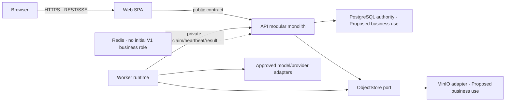
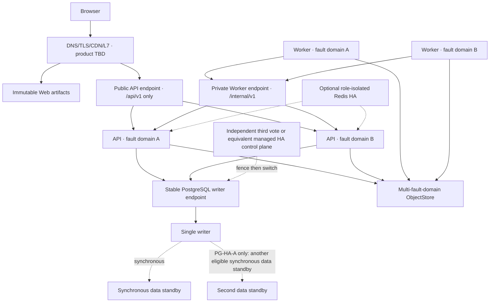

# FlowVerse V1 服务、中间件与运维详细设计

## 文档状态

**IN_REVIEW / PROPOSED — 本文是 V1.0～V1.2 服务、中间件和运维目标设计，不是业务代码、依赖、API、Schema、生产拓扑、预算或 ADR 的实施授权。**

| 项目 | 内容 |
|---|---|
| 适用范围 | FlowVerse V1.0 小说创作、V1.1 AI 内容分析与运营复盘、V1.2 AI 内容创作与运营闭环效果的累计运行底座 |
| 当前事实来源 | [Technology Stack Registry](TECH_STACK.md)、[Architecture Baseline](ARCHITECTURE_BASELINE.md)、[Reliability Budget](RELIABILITY_BUDGET.md)、[Performance Budget](PERFORMANCE_BUDGET.md) |
| 目标方案来源 | [V1 Technical Solution Proposal](V1_TECHNICAL_SOLUTION_PROPOSAL.md)、[ADR-0018](../decisions/ADR-0018-cross-store-recovery-and-deletion-ledger.md)、[ADR-0022](../decisions/ADR-0022-production-high-availability-topology.md)、[ADR-0024](../decisions/ADR-0024-cumulative-release-capability-activation.md) |
| 包与范围状态 | 每次实施前只从 [V1 Package Intake](../intake/V1_PACKAGE_INTAKE.md) 读取；本文不复制动态状态 |
| 明确限制 | 三个引用 ADR 均为 `Proposed`；生产环境、厂商、编排器、网络、精确副本数、容量、监控后端、备份工具和业务依赖版本尚未批准 |
| 验证状态 | 仅继承注册表中已有 Bootstrap 证据；本文未运行产品测试、构建、性能测试、故障切换或恢复演练，目标设计全部保持 `Unverified` |

本文使用以下状态词：

- **Confirmed current**：已由仓库注册表确认的目标与当前实现证据，只限其登记范围。
- **Proposed target**：建议的业务或生产目标，需用户接受、ADR/合同批准并完成实施验证。
- **Unknown**：没有足够证据，不得推断；到期时会阻断受影响的实现或发布。
- **N/A current**：当前切片没有该业务消费者；不表示未来永久禁止。

任何新增直接依赖、精确版本或命令，必须先进入 [Technology Stack Registry](TECH_STACK.md)，取得 `Confirmed` 证据和 `Available` 执行状态。本文出现的逻辑组件名称不是依赖选型。

## 1. 目标与非目标

### 1.1 设计目标

1. 延续已确认的 Web、API、Worker 三个代码服务，用最少进程边界承载同步交互、权威业务事务和长任务。
2. 让 PostgreSQL 成为 Proposed 业务权威事实与耐久作业账本；Redis 保持可选、可丢、可旁路；MinIO 只通过 ObjectStore 窄合同承载二进制对象。
3. 在不拆业务微服务的前提下，为进程、节点和单故障域的高可用方向保留安全选主、fencing、局部降级、N-1 容量和恢复门。
4. 让扩容、缓存、队列、读副本、向量检索、时间序列和多区域都由测量或新消费者触发，不提前建设空平台。
5. 使发布、迁移、回退、备份、删除和恢复形成可验证的操作合同，而不是依赖运维人员临场猜测。

### 1.2 明确非目标

- 不把九个已登记模块拆成九个微服务，不引入通用 Workflow Builder、自由 Agent、插件市场或任意 DAG。
- 不选择生产云厂商、容器编排器、负载均衡器、DNS/TLS 产品、托管数据库、对象存储、Redis HA 产品或观测后端。
- 不批准业务 API、表、bucket、Redis key、队列、缓存、索引、扩展、连接池、重试次数、告警阈值或副本数。
- 不把当前单主机 PostgreSQL/Redis/MinIO Compose 描述为生产 HA，也不把一次健康 smoke 描述为持续容量或恢复证明。
- 不把 pgvector、TimescaleDB、Redis 或 MinIO 的已部署能力等同于 V1 已有业务消费者。
- 不声称 99.9%、高性能、RPO=0 或自动故障切换已经通过；唯一已确认的可用性数字仍是内部 MVP 99% 目标。

## 2. 当前已确认栈与拟议业务依赖

### 2.1 状态分层清单

| 边界 | Confirmed current | Proposed target | 尚未获批或未验证 |
|---|---|---|---|
| Web | Node.js 24.17.0、pnpm 11.10.0、React/React DOM 19.2.7、TypeScript 5.9.3、Vite 8.1.4；当前仅有诊断 UI 与 React 内建状态 | 单 SPA、feature 垂直切片、版本化 API client、服务端状态呈现、离线普通草稿和 SSE 消费 | 产品 Router、query/form、IndexedDB、E2E/a11y 等依赖及其精确版本均未批准 |
| API | CPython 3.13.14、uv 0.11.28、FastAPI 0.139.0、Uvicorn 0.51.0；已有健康、诊断和九个边界声明中的八个 API 模块目录 | 模块化单体；身份、正式命令、事务、查询投影、capability、receipt、作业控制和审计的唯一服务端入口 | 业务 auth、API、Schema、限流、缓存、SSE 和服务身份合同尚未实现或批准 |
| Worker | CPython 3.13.14、FastAPI 0.139.0、Uvicorn 0.51.0；已有内部状态服务和一次性检查 | 经私有 API 领取租约，执行模型调用、文件处理、导出、封闭删除对账/恢复点构建和有界结果交付；不拥有正式业务事实 | 业务 claim/result 合同、provider、文件解析、导出、maintenance handler 和 DeliveryStore 均为 Proposed |
| PostgreSQL client | SQLAlchemy 2.0.51、Alembic 1.18.5、psycopg 3.3.4；API/Worker 已有有界诊断 | API 的权威业务数据、事务约束、幂等 receipt、作业账本、会话和配置激活存储候选 | 业务表、事务合同、索引、容量和生产 HA 未批准 |
| PostgreSQL server | PostgreSQL 18.4；镜像具备 pgvector 0.8.5 与 TimescaleDB 2.28.3 OSS 能力，扩展未自动创建 | V1 小说使用普通 PostgreSQL；未来按证据启用扩展或读扩展 | 扩展可用 SQL 查询尚未执行；无业务 Schema、负载、恢复或 HA 证明 |
| Redis | Redis Open Source 8.8.0 已部署；认证诊断已通过；无业务消费者 | V1 初始业务路径关闭；未来按角色分别用于 cache、rate-limit 或 SSE wake-up 候选 | 任何业务 key/TTL/复制/淘汰/持久化/容量和降级合同均未批准 |
| MinIO | `RELEASE.2025-10-15T17-29-55Z` 已构建并达到一次健康状态；诊断签名路径已测试 | 作为 ObjectStore 合同的一个 V1 adapter，承载参考原件、截图、执行临时包和导出等二进制对象 | 业务 bucket、账号、TLS、加密、生命周期、备份和恢复未批准；当前凭据的实时认证仍为 `Unverified` |
| 可观测性 | API/Worker 已锁定 structlog 26.1.0 与 OpenTelemetry 1.43.0；仅本地关联日志/span，无 exporter | 稳定 log/metric/span 语义；部署层选择 exporter/backend，关键业务链路可关联 | 监控后端、采样、保留、告警、值班和错误预算执行策略均 Unknown |
| 部署 | 本地 Web/API/Worker 原生进程；服务端单主机三中间件 Compose；两者所有权分离 | 单区域多故障域逻辑生产拓扑、分层入口/readiness、单 writer 和跨存储恢复集 | 应用生产平台、制品、CI/CD、LB/TLS/DNS、精确资源与副本全部 Unknown |

现有依赖只证明 Bootstrap 所需能力。业务实施不得因为包已锁定就自动导入某项库；反过来，本文也不发明 Router、auth、缓存、队列、对象 SDK、监控或安全库的版本。

### 2.2 三服务逻辑关系

目标生产依赖必须保持有向、无环：`Web → API`、`Worker → API`、API 应用层 → 模块公共入口/私有 persistence、Worker → provider/ObjectStore adapter。API 不通过业务接口启动 Worker，Worker 不直接读写 API 私有业务表，也不导入 API 源码。

当前 Bootstrap 的 API → Worker 内部状态诊断是已确认的诊断合同，不是未来业务依赖。引入 Worker → API 的业务 claim/result 之前，必须由相应 ADR 明确保留、替换或退役诊断边界并更新架构注册表，不能静默形成双向生产依赖环。

## 3. 进程、模块与数据所有权

### 3.1 进程责任

| 进程 | 唯一责任 | 可以持有 | 不得持有或执行 |
|---|---|---|---|
| Web | 用户/管理员 Shell、路由体验、可访问交互、草稿编辑缓冲、服务端结果展示 | URL 状态、页面局部状态、待同步普通草稿、可丢查询缓存 | 权威任务/Cycle/权限/预算状态；服务端状态机；正式操作的乐观成功；中间件 locator |
| API | 身份与授权、业务用例、模块事务、正式命令、查询、capability、receipt、作业受理、活动和审计 | PostgreSQL 事务、模块私有 repository、对象 metadata/locator adapter、服务端配置快照 | 长模型调用、整文件解析、导出生成；在事务内调用 provider/ObjectStore；把前端隐藏当授权 |
| Worker | 有界长任务执行、模型适配、文件验证/解析、导出、封闭维护、心跳和结果回报 | 当前 typed job context 的最小执行包、临时工作区、Proposed 有界 DeliveryStore | 用户/管理员 session；业务表直写；正式内容/分析/Cycle 确认；任意脚本/维护任务；自行改状态机、政策或 Prompt activation |

每个同步请求只承担鉴权、有限查询或短事务。可能持续数分钟的模型、文件和导出工作必须在提交受理事实后异步执行；任何数据库事务都不能跨越外部 I/O。

### 3.2 模块状态与目标边界

| 模块/运行职责 | 当前归属 | Current conformance | Proposed 业务所有权 |
|---|---|---|---|
| `identity_access` | API | 仅边界声明 | 账号、密码凭据、会话、锁定、角色、授权和调试访问 grant |
| `task_lifecycle` | API | 仅边界声明 | Task、两个基线版本、P01 Bot conversation/message/action-card/unapplied-draft、生命周期/控制/可见性/删除状态和权威 next action；Bot只导航/产普通草稿 |
| `creative_reference` | API | 仅边界声明 | 参考 metadata、权利、logical object version 引用、提取版本、片段、引用清单与删除影响；不拥有通用对象目录 |
| `creative_content` | API | 仅边界声明 | 草稿、候选、正式内容版本、snapshot manifest 与作品记忆 |
| `review_compliance` | API | 仅边界声明 | Review、冲突、分歧、风险接受、合规与版权检查记录 |
| `release_cycle` | API | 仅边界声明 | 包装、计划、实际投放、外部事实、Cycle、观察点和有效性 |
| `feedback_decision` | API | 仅边界声明 | 反馈、指标、分析候选/正式分析、人类决策、下一轮方案和比较 |
| `governance_ops` | API | 仅边界声明 | 通用 logical object/version/upload/verification 目录；配置/政策/Prompt/评测/eligibility assessment/激活、活动、审计、导出/删除/恢复治理元数据；Worker maintenance 仅执行其封闭命令，不成为数据 owner |
| `ai_execution` | Worker | 非业务检查已实现 | 固定 workload 执行、provider adapter、在途调用和临时工作区 |
| `execution_control` | API | 未登记、未实现 | Proposed：预览、不可变执行绑定、作业、租约、attempt、用量与费用 |
| `document_processing` | Worker | 未登记、未实现 | Proposed：受限文件校验/解析运行时，不决定权利或正式状态 |
| `export_generation` | Worker | 未登记、未实现 | Proposed：按不可变 export manifest 生成固定格式，不改变源事实 |

后三个 Proposed 边界在相应架构决策、owner、公共合同和注册表获批前不能创建。模块内部可分 domain/application/persistence/transport，但跨模块只传稳定 ID、版本引用、值对象和显式结果；禁止跨 owner 读表、传 ORM entity 或泄漏 Redis/MinIO/provider 类型。

Worker runtime 只注册四类固定 handler：`ai_execution`、`document_processing`、`export_generation` 与 `maintenance`。`maintenance` 不是新领域/data owner，只执行 `governance_ops` 已创建的 `DELETION_RECONCILIATION` 或 `RECOVERY_CHECKPOINT_BUILD` typed job；未知 subtype/target 在 registration、claim、progress/result 三处拒绝，不允许通用 cron、任意脚本或插件。

Prompt 只有专用 PromptActivation authority；通用配置激活只接受封闭的场景/Agent/Review/合规/平台规则类型，并在数据库层排除 Prompt、decision family、provider/model 与 price。EvaluationBinding 保持不可变，运行/失效/重新资格化追加 EligibilityAssessment revision；JIT 锁定最新有效revision，不能通过普通配置发布路径旁路。

### 3.3 一致性与事务边界

- 正式命令由 API 在 PostgreSQL 中执行 `expectedRevision + idempotency + capability recheck + business unique constraint`。
- ActualRelease 确认与 Cycle 创建必须在一个事务中同时成功或同时失败；一 Task 最多一个活跃 Cycle，编号在 Task 锁内永久递增且不复用。
- Web 收到权威 receipt 后才显示正式完成；结果未知时查询 receipt，不能盲目再次创建。
- Worker 只能提交不可变 execution output/attempt result 候选；API 在复验 fencing token、绑定、政策和状态后，调用数据 owner 的公共用例形成业务候选。
- PostgreSQL 与 ObjectStore 不做分布式事务；对象使用 `quarantine → verified → committed` 的 Proposed 生命周期，只有已验证 immutable version/hash 才能被 PG 正式引用。

## 4. PostgreSQL 详细设计与替换边界

### 4.1 当前能力与 Proposed 用法

当前已确认的是 PostgreSQL 客户端、迁移工具、健康诊断和服务端镜像能力，不是以下业务 Schema。若方案获批，PostgreSQL 承担：

- 模块权威事实、不可变版本/替代链、revision 和业务唯一约束。
- opaque session、锁定状态和授权元数据候选；精确认证合同另批。
- idempotency receipt、正式 command outcome 和长期业务去重守卫。
- execution request、queue record、lease/fencing、attempt、step、output metadata 和 cost ledger。
- activity、audit、配置/政策/Prompt activation 引用和可重建查询投影。
- object logical metadata、immutable version/hash/size/status 和领域引用；不保存 provider bucket/key 到领域表。

Redis、对象存储、浏览器草稿和日志均不能替代上述权威记录。

### 4.2 访问与性能规则

- API 是业务数据库访问 owner；Worker 的现有 `SELECT 1` 只属于诊断，不授权未来业务直连。
- API 副本共享一个全局连接预算。所有实例 pool、唯一 migrator、监控/运维保留和故障切换余量之和必须低于已批准数据库安全容量；精确数字需测量后确认。
- 普通读取按 Task/owner 边界、有界字段和稳定 cursor 查询；正文按章加载，增长型 history/activity/audit 列表禁止无界读取和深 offset。
- 禁止 N+1、`SELECT *`、跨模块直接 join 私有表、在事务中等待 provider/ObjectStore，以及把 ORM 对象直接序列化为公共 DTO。
- 索引必须对应真实查询和代表性计划证据，同时记录写放大；pgvector/TimescaleDB 不因镜像可用而自动启用。
- 正式命令、capability、receipt、next action 和 command 后读取走 writer。只有报告/历史读形成可测瓶颈且允许明确 staleness 后，才评估读副本。

### 4.3 耐久作业候选

V1 Proposed 初始作业交付使用 PostgreSQL 作为唯一耐久账本，不增加 broker：

1. API 在一次事务内保存一个execution request及冻结input；首次1..N模型选择为每个稳定lane分别保存Prompt/Evaluation/ExecutionBinding、initial attempt、预算预留和queue record，再保存共享slot、批次总预算、receipt和activity。任一lane建链失败则整批不授权；retry/fallback只在原lane用新preview/new binding/new attempt/job。
2. Worker 经私有 API 请求工作；API 内部可用短事务和 `SKIP LOCKED` 选择候选，但 Worker 不认识表或 SQL。
3. API 返回服务端签发的`jobContextRef/hash`、`leasePurpose`、有期限 lease、单调 fencing token 与当前job revision；Worker 定期心跳，`INT-004..008`都携带并校验完整 tuple。封闭 `jobContext` 为：AI 固定`BUSINESS|EVALUATION` purpose、可空`CANDIDATE|CONTROL` evaluationArm与`TARGET|JUDGE` evaluationCallRole、execution、单模型lane attempt、binding并按步骤携带step，文档处理固定object version，导出固定export request，maintenance固定`DELETION_RECONCILIATION+deletionRequest`或`RECOVERY_CHECKPOINT_BUILD+recoveryCheckpoint`。BUSINESS arm/role必须为空；EVALUATION TARGET要求arm、JUDGE arm为空且role/arm匹配EvaluationBinding。非AI作业不得伪造execution/attempt/step；maintenance不允许其他subtype。`INT-009`是receipt-bound、可在lease失效后只做ACK/erase/GC的窄例外。
4. 租约失效只允许未产生不可逆外部副作用的步骤重新领取。provider outcome 不明或可能已计费时进入人工恢复/新 attempt，不自动重放。
5. Bot、业务AI、AI评测、文件、导出、封闭维护是独立workload class，共享总资源但拥有各自的到达、积压和拒绝/排队策略；评测使用独立pool/quota/cost，不能挤占或生成业务candidate/formal；精确预算由可靠性与性能测试冻结。
6. API按`pool_key`先隔离付费AI、对象处理、导出和维护容量，再在pool内以到期时间、优先级和有界aging/fairness选择；`SKIP LOCKED`只解决并发占有，必须用持续高优先级流量下的低优先级哨兵job证明无饥饿。
7. 空claim返回`nextClaimNotBefore`；连续空领取、429/503和网络故障只由Worker claim loop执行有界指数退避+jitter。精确下限/上限/总时长为Proposed，禁止API client、SDK和外层supervisor叠加自动retry。
8. 每次provider调用前，Worker提交稳定`callIntentId+resolvedCallInputManifestRef/hash+requestHash`和provider幂等能力版本；API在单一PG事务中锁定job/purpose/arm/role/lane/attempt/step/binding与lease/fencing，再按purpose重验。BUSINESS锁定匹配modelProfile的activation和最新EligibilityAssessment revision并验证安全撤销/证据资格；EVALUATION锁定typed authorization manifest/hash、expiry/revoke链、comparison mode/basis/arm/order、EvaluationBinding/dataset/license/独立预算与`EVALUATION_ARTIFACT_ONLY`，OFFLINE验证管理员authority，SHADOW验证不可变rollout authority manifest和用户D01 consent。provider TARGET只匹配真实PromptConfig arm；typed baseline不是TARGET lane。JUDGE binding只冻结basis-specific dependency selector，所需证据未receipted前不可claim/call-start，实际artifact或baseline ref/hash/receipt由JIT冻结进ModelCall input。两者都重验policy/price/budget、input/object、cancel/deletion，把真实调用输入、assessment或evaluation-authorization ref/hash/kind/basis/arm/role、ModelCall意图/receipt与可重建的确定性key derivation或加密key/ref一起写入，提交后才返回短时单用途JIT call-start授权及同一exact provider key。同intent/hash重领必须返回同一key；provider不支持受验证幂等时不得自动恢复未知调用。purpose/basis/arm/role/lane或权威依据漂移直接冲突；更新的正常activation不改写运行中BUSINESS binding，严重安全revoke才阻止尚未开始step；越过该边界即按外部副作用可能发生处理。
   - JUDGE依赖按comparison basis判别：DIRECT=candidate TARGET receipt；PROMPT_ONLY=两个provider TARGET arm；BASELINE_GATE=candidate receipt+typed baseline artifact/人工批准receipt且无control ModelCall；FACTORIAL=冻结factor plan声明的组合。JIT与finalizer使用同一证据集合。
9. 达到获批attempt/age/unknown-outcome条件，或DeliveryStore满载/损坏时，job进入`WAITING_DIAGNOSIS/RETIRED`候选并停止自动领取；诊断结果只能创建有receipt的新attempt、明确终结或保持等待，不能把旧job静默复活。

Worker 不从 typed owner ID 推断 bucket/key，也不读取业务数据库。统一 `GET /internal/v1/jobs/{id}/inputs` 在 active lease/fencing/revision 下只查询immutable payload manifest/grant descriptor；短时read/write capability仅由幂等`POST /internal/v1/jobs/{id}/input-grants`签发/续签，`grantRequestId+digest`使响应丢失返回同一record/grant。普通grant绑定job/context/purpose/method/objectVersion/expiry；写DeliveryStore另须按`job+context+reportKey`唯一的`DELIVERY_BUFFER_CREATE`短时单record/no-overwrite/maxBytes grant并绑定lease/fencing/revision、report-envelope ref/hash和expiry，同key异hash不得创建第二record。取消、policy revoke、context漂移、对象状态变化或删除barrier后普通grant必须拒绝。仅pre-barrier CALL_START_COMMITTED可取得`DELETION_DISPOSITION` lease及业务不可读的`DELETION_DISPOSITION_BUFFER`单record grant，且无provider/原输入/第二结果权限；`DELIVERY_RECOVERY`只有原report-envelope/delivery record读取grant。

未来 broker 替换前必须先证明 queue age、锁竞争、消费者隔离或路由持续违反已确认预算，并设计 single claim owner、迁移、去重、outbox 和恢复；不能让 PostgreSQL 与 broker 同时成为双作业事实源。

### 4.4 PostgreSQL 替换与扩展合同

V1 不建设“任意关系数据库”最低公分母。模块私有 persistence 隔离 SQLAlchemy/psycopg 与 SQL，但会有意识使用 PostgreSQL 的事务、锁、约束和 queue-like claim 能力；替换数据库属于结构性迁移。

| 变化 | 稳定面 | 必须证明 |
|---|---|---|
| 垂直扩容/连接代理 | 公共 API、事务和 receipt 语义不变 | 连接等待、事务/查询治理后仍有瓶颈；failover 与连接恢复 |
| 读副本 | 只有明确可陈旧的查询可路由 | staleness、read-after-write、切换、容量和恢复 |
| 分区/物化投影 | source revision 和权威表不变 | 代表性表增长/查询瓶颈、投影可重建、lag 与一致性 |
| pgvector | 引用查询合同和可解释 source locator 不变 | 真实语料质量不足、embedding 政策/成本/维度/回填/索引性能获批 |
| TimescaleDB | 指标业务合同和 `asOf` 语义不变 | 时间序列量、保留/聚合/窗口查询经测量需要；小说 V1 不提前启用 |
| 抽库或换数据库 | 模块公共合同与数据 owner 不变 | 独立扩缩/发布/安全 owner、迁移双向核验、恢复和运营能力均成立 |

## 5. Redis 角色设计与缓存纪律

### 5.1 当前结论

Redis 8.8.0 的部署和诊断是 Confirmed current；V1 初始业务路径没有 Redis consumer，状态为 N/A current。普通查询、正式命令、幂等、作业、会话、预算、锁和 Cycle 不得因为 Redis 已运行就迁入 Redis。

### 5.2 逐角色激活

| 候选角色 | 激活证据 | 一致性与降级 | 明确禁止 |
|---|---|---|---|
| Query cache | 指定只读查询在查询治理/索引后仍持续违反预算，并有命中率收益 | key 含 actor/task/object/revision；有 TTL、容量和精确失效；Redis 故障旁路 PG | 缓存唯一正式事实、capability、receipt 或刚写后的权威结果 |
| Rate limit | 生产入口和滥用模型获批，需要跨 API 副本共享计数 | 安全关键限流的 Redis 不确定状态必须按批准策略 fail closed；普通资源保护可显式降级 | 未定义故障语义就默认放行或把用户级业务槽仅存 Redis |
| SSE wake-up | PostgreSQL 空轮询已形成可测负担 | 通知可丢；cursor 和 PG 权威事件保证恢复；故障转有界轮询 | 把 Pub/Sub 当事件历史或状态源 |
| Queue/broker | PG 作业在 queue age、锁竞争、路由或独立消费者方面持续失败 | 先冻结 single claim owner、outbox/dedupe、在途 attempt、费用和切换 runbook | 未经迁移双轨写入、依靠 AOF 取代权威 receipt |
| Session acceleration | 已批准 auth 合同且 PG 路径测量不足 | PG 或其他批准 HA 权威仍拥有撤销真相；Redis 丢失不能让已撤销 session 复活 | 把未复制/可淘汰缓存作为唯一会话权威 |

一个 Redis 实例承担多个角色之前，必须分别确认 key namespace、ACL、持久化、淘汰、内存、复制/failover、备份适用性和 noisy-neighbor 风险。耐久流与可淘汰缓存如策略冲突，应使用角色隔离而不是共享一个万能实例。

### 5.3 Web 与服务端缓存共同规则

- 每个缓存必须声明 owner、key、值 Schema、TTL、容量、失效触发、旁路、预热、隐私和恢复行为。
- 不缓存用户未授权正文到公共 CDN；公共、content-hashed Web 静态制品可在生产交付方案批准后使用 CDN。
- 浏览器 query cache 是可丢展示状态；IndexedDB 普通草稿是需保护的用户输入，两者不能共用清理语义。
- snapshot 等不可变资源可按版本键缓存；权限、政策、价格、预算、capability 和正式确认预览必须在执行前重新验证。
- 没有基线与命中收益时，不启用预热、全局 memoization、持久 query cache 或 Service Worker。

## 6. MinIO/ObjectStore 设计与替换合同

### 6.1 数据分工

| 数据类别 | PostgreSQL Proposed owner | ObjectStore Proposed payload |
|---|---|---|
| 参考、截图、导出 | logical ID、owner、权利、状态、hash、size、media type、retention、领域绑定 | 私有 immutable bytes/version |
| 提取文字和结构 | 可查询、可引用的版本化片段与 locator | 只有超大中间产物在批准后对象化 |
| 小说正文/正式版本 | 权威正文、版本和 snapshot manifest | 不作为正文唯一事实源 |
| Execution package/result | manifest、绑定、状态、hash 和业务引用 | 有界临时包、超大原始输出或 Proposed DeliveryStore payload |
| Provider locator | adapter mapping | bucket/key/provider version 只留在 adapter/部署边界 |

截图只能作为人类核验对象，禁止进入模型输入。业务启用 MinIO 前必须批准 bucket/账号、TLS、加密、最小权限、生命周期、容量、备份和恢复；当前 live auth 的 `InvalidAccessKeyId` 仍是阻断项，不能写成已可用业务存储。

ObjectStore分三层证据且不能相互替代：`Current`只记录服务健康与最新live-auth事实（当前完整认证仍Failed/Unverified）；强制的`H0 business/DataSafety gate`要求非管理应用identity、批准bucket/purpose隔离、TLS/加密/轮换、quarantine/write、指定immutable version read/head/range、hash/size/MIME、commit/grant/expiry、越权/list/overwrite拒绝、容量/生命周期、备份/版本、consistent-cut恢复、delete/ledger防复活、restore和adapter错误归一化；另行适用的`Availability gate`才要求跨故障域耐久、副本/故障包络、N-1和可用性演练。只有`UD-AVL-01`或后续明确批准使Availability适用于该发布时，后一层才阻断对应可用性声明；它不替代H0 DataSafety。任一到期门未过只关闭依赖对象的capability，不得把health check、管理凭据或单节点volume当通过证据。

### 6.2 ObjectStore 窄合同

领域只认识 `logicalObjectId + immutableVersion + SHA-256 + size + mediaType + lifecycleStatus`。Proposed port 只覆盖当前需要的数据面语义：

- 有界、可取消的 stream put/get/head/range。
- 创建 quarantine upload capability 与短时、单对象、最小权限读取能力。
- 服务端验证后的 immutable version 提交与状态查询。
- 以稳定 command/对象版本执行幂等删除。
- 归一化 `not_found/forbidden/conflict/timeout/capacity/unavailable/integrity_failure` 等错误类别。
- 返回 provider capability profile；不得把 S3 方言差异、bucket/key、管理 API、SDK 类型或 ETag 泄漏给领域层。

ETag 不能替代内容 SHA-256。所有 adapter 必须通过同一合同测试，包括 deadline/cancel、Range、重复 finalize/delete、版本漂移、权限、完整性和错误归一化。

### 6.3 上传、验证和访问状态机

1. API 校验 actor/task、权利声明、申报类型/大小和容量，创建 logical object、upload session 与 `uploading/quarantine` 状态。
2. 浏览器用短时、单对象、限定操作与最大字节的 capability 直传；API 不缓冲整文件。
3. finalize command 幂等封存 session 并创建 verification job；客户端 MIME/hash/size 仍只是申报。
4. Worker 在隔离、无外网、资源有界环境流式计算实际 SHA-256/size/MIME，验证 object/version/session 绑定和压缩展开边界。
5. API 复验结果后才进入 `verified/processing/committed`；失败对象保持不可见并进入可重入清理。
6. 只有 committed reference 可进入正式 snapshot、execution manifest 或导出；下载和 Worker 读取使用短时受限能力。

### 6.4 替换、迁移与退役

MinIO 是一个 adapter，不是领域合同。更换到其他 S3 类或非 S3 ObjectStore 时采用：

1. 冻结版本化 adapter capability 与对象 manifest。
2. 将 immutable version 复制到新目标。
3. 按 logical ID、version、SHA-256 和 size 全量核验。
4. 先 shadow read，再切新写，保留有限期旧源只读 fallback。
5. 验证删除账本覆盖、恢复 checkpoint、访问控制和代表性吞吐。
6. 观察窗、恢复演练和清理审批通过后退役旧源；不永久双写。

## 7. 异步执行与长任务运维

### 7.1 生命周期

Proposed execution 状态至少区分受理、排队、运行、等待用户、部分完成、取消、超时、失败和 outcome unknown；精确枚举由 API/Schema 合同批准。固定规则：

- 一个用户只有一个付费槽；一个Task只有一个业务步骤；步骤内最多三个模型。每个模型是独立lane/binding/attempt/job，同批共享冻结输入、slot和总预算上限，candidate set只在结果侧聚合；评测执行使用独立pool/quota/cost，不冒充业务步骤。
- queued 可取消且不产生本次执行费用；running 取消只阻止尚未开始的步骤。
- 总 deadline 不超过 30 分钟；最迟每 10 秒提供真实阶段更新或明确 external wait。
- retry/fallback或换模只在原lane经新preview创建新binding和递增attempt；不静默换模，不跨lane复用binding，不自动重复outcome unknown或可能已计费的provider call。
- 成功的部分输出与实际费用不可因其他步骤失败而丢失。
- 领取前API按purpose/role重验：BUSINESS检查匹配modelProfile activation/最新eligible assessment；EVALUATION检查typed OFFLINE或SHADOW authorization、EvaluationBinding/dataset/license/独立预算与TARGET/JUDGE plan，SHADOW还检查rollout authority、用户D01 consent和slot/cost范围。两者都检查输入revision、政策、价格、预算与适用slot/pool。变化进入`requires_repreview`或评测重新授权，绝不在purpose/role间降级切换。

### 7.2 DeliveryStore 边界

每个包含payload、partial、usage、cost或provider outcome artifact的Worker result/failure，在首次向API report之前都必须把payload、不可变`job-report-envelope/v1`、单向引用该envelope的delivery record和unreceipted-index entry在同一Proposed加密、有界、可恢复DeliveryStore durability boundary中write-through并取得`RESULT_BUFFERED`，不能因为API当前可达而跳过provider-return→API-receipt之间的耐久边界；纯无payload/usage/cost failure不建delivery record，但仍以稳定reportKey写最小幂等report receipt。report envelope不含delivery record ref/hash；API先校验envelope hash并预分配稳定record ref，再签单record/no-overwrite grant。delivery record冻结envelope ref/hash、typed context、result、producer proof、initial state与适用的usage/cost并生成自己的hash；后续`REPORTED/ACKNOWLEDGED/SECURE_ERASED/GC`只追加transition，不回写两者hash。AI context绑定purpose/role/execution/lane/attempt/binding/step/call，文档处理绑定object version，导出绑定export request，maintenance绑定封闭subtype与deletion request/recovery checkpoint。API返回同一context/result的耐久`ACCEPTED` receipt后才可正常ack和清理；若task已有耐久deletion intent+tombstone，则只写`DISCARDED_BY_DELETION`处置receipt而不创建用户派生事实，Worker据此安全擦除。单个EVALUATION TARGET/JUDGE结果只写评测artifact/cost/run progress，只有API finalizer在完整plan、validator、hard-fail与所需人审闭合且无stale后才追加一个EligibilityAssessment，不能生成business candidate/formal。开发环境可评审本地spool；任何生产HA声明都要求该缓冲跨Worker进程/节点故障耐久，不能只放本地临时盘。

DeliveryStore 不是业务事实源、第二queue或自动replay许可；它必须有容量上限、保留、加密、清理、完整性 hash、逐pool告警和满载行为，并向API reconciliation提供鉴权、有界、稳定snapshot/cursor、单调sequence/HWM且按`job/context/reportKey`唯一的unreceipted index。满载、不可写、index不可证/分页gap/lag越门、超期或API长时不可达时，Worker先停止对应pool claim并进入诊断环，reconciliation和删除cleanup fail closed，不能删除未获 `ACCEPTED|DISCARDED_BY_DELETION` receipt 的result或failure artifact。producer在RESULT_BUFFERED后首次report前崩溃或lease过期时，API只能基于该index签发`DELIVERY_RECOVERY` lease；恢复Worker复用原envelope/ref/hash和producer proof，只提交既有buffer，不得调用provider、改变digest或生成新结果。`delivery-acknowledgement` 是 receipt-bound 终态窄例外：即使INT-007或含artifact的INT-008提交后响应丢失、原lease过期或Worker重启，API也按`job+reportKey`找回已耐久receipt，再凭 workload identity、job/context、delivery/result hash、receipt中producer/acceptance proof幂等完成ACK/secure erase/GC；客户端receiptRef可选且只作一致性校验，ack不能再写owner结果。具体实现和依赖仍 Unknown，需随异步 ADR 批准。

### 7.4 Worker 摘流与诊断闭环

摘流顺序固定为：`stop claim → heartbeat RETIRING → 有界完成未越副作用边界的step → 所有待报告结果确认RESULT_BUFFERED → 向API交付并取result-or-discard receipt → delivery ack/清理 → lease释放/到期 → TERMINATED`。API必须能区分`not-started / call-start-committed / provider-outcome-unknown / result-buffered / delivery-recovery / result-accepted / discarded-by-deletion`；只有`not-started`可在lease到期后作为普通WORK自动重新领取。`result-buffered`只能进入不触发provider的DELIVERY_RECOVERY；JIT授权响应丢失或Worker崩溃时，只有provider已验证同一exact idempotency key才可恢复同一call intent，否则必须保持outcome unknown并由人工决定新preview/attempt。

### 7.3 背压与隔离

- API 受理前检查 backlog age、用户/任务槽、数据库/对象空间、provider quota 和预算；达到批准门时显式排队或拒绝。
- API 交互请求与 internal claim/result 使用不同的网络、身份、限流和并发预算；是否需要物理 pool/副本隔离由饱和测试决定。
- 每个 provider/model、文件解析和导出 workload 使用独立有界并发；禁止无界 task、fan-out、batch、SSE buffer、临时目录和日志队列。
- Worker 横向扩展同时受 queue age、service time、provider quota、PG 总连接/请求预算和 ObjectStore 容量约束，不能只按 CPU 自动加副本。

## 8. 部署拓扑与网络边界

### 8.1 当前可执行拓扑

| 环境 | Confirmed current | 边界 |
|---|---|---|
| 本地开发/测试 | Windows 原生 Web/API/Worker，由注册 PowerShell wrapper 启动 | 不使用 Docker；当前只证明 Bootstrap/诊断路径，不证明业务或生产 |
| 开发中间件服务器 | 单主机 Compose：PostgreSQL、Redis、MinIO，端口默认 loopback；本地可用 OpenSSH forwarding | 一次 build/health smoke；不是 HA、容量、TLS、监控、备份或恢复证明 |
| 应用生产 | Unknown | 未选择平台、网络、制品、CI/CD、secret、LB/TLS/DNS 或资源 |

现有服务器中间件 Compose 必须继续保持与应用部署分离；不得把 Web/API/Worker 偷加到三中间件项目并称为生产方案。

### 8.2 Proposed 生产逻辑拓扑

这是 ADR-0022 的 Proposed 逻辑目标，不是已批准物理清单：

- Web 使用不可变 content-hashed 制品和原子版本切换；当前生产制品/托管方式 Unknown。
- API/Worker 覆盖至少两个批准故障域是 Proposed 容错方向；最终副本和资源由失去一个故障域后的容量测试确定。
- public endpoint 不存在 `/internal/*` 路由。internal endpoint 使用独立 workload identity、网络可达性、限流、并发和 readiness；不能 fallback 到公网入口。
- PostgreSQL在ADR-0022接受时必须明确二选一：`PG-HA-A`=三个data-bearing节点跨批准故障域，writer提交需至少一个合格同步standby确认，并有可证明quorum/fencing控制面；eligible集合不得自动缩为空或降成异步。`PG-HA-B`=writer+唯一同步data standby+独立第三票/等价控制面，但该standby丢失/不同步时formal write立即fail closed直到冗余恢复验证。两者都保持稳定writer endpoint；只有多数派、同步资格和旧主fencing均可证时才提升。当前选择与演练均Unverified。
- 当前单节点 MinIO 不能直接提升为生产 HA。对象存储必须提供跨故障域耐久候选并通过恢复验证。
- Redis 无业务角色时不部署进关键路径；启用后必须使用与角色相符的 HA、容量和降级合同。

### 8.3 分层健康与就绪

| 信号 | 含义 | 不应包含 |
|---|---|---|
| Liveness | 进程事件循环/主线程仍可响应，不应被重启 | 下游数据库、provider、对象或 Redis 健康 |
| Startup | 配置解析、必要本地初始化完成 | 长时业务扫描、迁移争抢或外部全链探测 |
| Public readiness | 该 API 实例能安全服务 public 合同，配置/Schema 兼容并可访问权威 writer | 可选 provider/ObjectStore/Redis 全部成功 |
| Internal readiness | service identity、私有 claim/result 合同和其资源预算可用 | 公网路由或用户 session |
| Capability readiness | 某一动作所需对象、政策、provider/ObjectStore/Redis 等当前可用性与禁用原因 | 把所有能力合成一个进程 ready 布尔值 |

PostgreSQL writer/Schema 不安全时，要求权威新鲜度的服务和正式写入 fail closed；provider、ObjectStore、Redis 或观测后端故障只影响对应 capability，不能导致所有 API 副本被共享 readiness 级联摘除。

Production H0 的 operational router 只保留五条独立运维合同：API `GET /health/live|ready|dependencies` 与 Worker 私网 `GET /health/live|ready`；它们不计入业务 Public/Internal 目录，不进入产品导航或 capability。API liveness 不查下游；API `/health/ready` 由受控listener/probe audience服务器侧固定为`PUBLIC`或`INTERNAL` scope并在响应中回显，PUBLIC只看writer/schema/public pool，INTERNAL另看workload identity/claim-result schema/internal pool，两者不互相级联摘流，客户端query/header不能选择scope。API readiness/dependencies 均不调用 Worker；Worker production 无业务 PG credential，liveness/ready 不直接探测业务 PG。现有 Web Check page、public `GET /api/v1/system/chain`、internal `GET /internal/v1/system/status` 必须在 production 成对移除/不注册或 `404/410`，只允许在隔离的非生产 diagnostic profile 同时启用。暴露面、身份与响应语义以数据/API合同第4.5节为唯一明细源。

## 9. 高可用、容量与性能

### 9.1 目标边界

| 指标/约束 | 状态 | 本设计解释 |
|---|---|---|
| 内部 MVP 可用性 99% | Confirmed product target | 统计采样和 error-budget exhaustion 仍需补齐；不是商业 SLA |
| 核心服务 99.9%/月 | Proposed | 只有 SLI、窗口、故障包络、维护口径、告警和演练均获批后才成为发布门 |
| 普通打开/切换/筛选/保存反馈 P95 ≤ 2 秒 | Confirmed product target | 需批准数据集、环境、命令和分段测量；当前未验证产品路径 |
| 保存状态 ≤ 2 秒；停止输入 5 秒后开始保存 | Confirmed product target | 保存不得阻塞继续输入；正式确认立即提交 |
| AI 受理状态 ≤ 2 秒；最长 10 秒可理解更新；总 deadline 30 分钟 | Confirmed product target | provider 完成时间单独统计，不混入普通 API SLI |
| 普通参考处理目标 3 分钟 | Confirmed product target | 精确文件规模和命令 Unknown |
| N-1 容量 | Proposed | 失去一个批准故障域后满足核心预算或进入批准的显式降级；当前无结果 |

### 9.2 容量模型

容量只能从批准的代表性负载产生。至少冻结活跃用户/任务、峰值请求、SSE 连接、章节/版本/历史、对象数量/大小、作业到达率/服务时间/backlog、provider token/延迟/配额和增长窗口。

- HTTP 在途量用到达率 × 响应时间估算，再以稳态、峰值、突发和降载恢复验证。
- 队列稳定要求到达率低于有效处理能力，同时观察 oldest-job-age/P95 queue age，而不是只看 depth。
- PG 连接预算必须覆盖全部 API pool、唯一 migrator、运维/监控保留和故障切换余量；扩 API 副本时重新分配，不能无限叠加。
- 对象吞吐按并发传输、代表性 object size、上传/下载/Range/复制目标分别验证，API/Worker 不整文件缓冲。
- AI 容量先服从一用户付费槽、一 Task 一业务步骤、一步最多三模型，再服从 provider quota、费用和 Worker 资源。

当前中间件的轻量配置和卷容量目标仅属于服务器中间件基线，不能当作产品负载或生产 N-1 证明。任何资源数值变更必须回写预算/注册表并保留测量证据。

H0 benchmark固定输入为每task最多20文件、每文件10 MB/50万字符、每task合计200万字符、文字PDF最多300页，以及代表性默认20章大纲+首批3章；前五项是上限fixture，默认创作范围不是硬容量上限。每个short/target/limit × cold/warm run必须记录环境/资源/网络、H0物理allowlist hash、并发/queue、样本/噪声、命令、P50/P95/P99、错误/饱和/恢复和原始结果。除固定输入外，profile/阈值仍Proposed/Unverified；不能从当前容器limit、一次health或单用户演示反推容量。

### 9.3 热路径约束

- P01 各确定性区域独立加载/失败，Bot/provider 故障不阻断 Continue Work、Pending 和 Task List。
- 草稿/正式命令同步路径只做权限、验证、短事务、revision/idempotency 和 receipt；Review、diff、导出、模型与解析异步。
- SSE 仅发 ID、event type、revision、cursor、时间和错误分类，不发正文或全轨迹；重连后读取权威快照。
- 当前章节、两个候选和有界周边数据按需加载；不一次加载全书、全部历史、Bot conversation 或 execution trace。
- 静态 route 级切分优先于每组件 lazy-load；不得引入未批准的浏览器模型/object SDK、图形工作流库、整套 UI 库或字体包增加首屏。
- 性能优化不得放宽 revision、idempotency、权限、正式确认、恢复、IME、selection、undo 或 accessibility。

### 9.4 扩缩原则

- API 参考端到端 latency、in-flight、CPU/内存和 PG pool wait 扩缩；数据库已饱和时加 API 会恶化故障。
- Worker 按 workload class 的 queue age、service time、利用率和 provider quota 扩缩；lease/fencing 和费用去重必须在多副本下通过。
- PostgreSQL 先治理 query、transaction、index 和 pool，再按证据评估垂直扩容、连接代理、读副本、分区或抽库。
- ObjectStore 先测 stream/Range/multipart、临时空间和后台复制，再调整并发；私有数据不进入公共 CDN。
- 所有 pool、queue、batch、fan-out、buffer、cache 和临时空间必须有边界、拒绝/降级行为、监控和 owner。

## 10. 可观测性与操作控制

### 10.1 信号与关联

沿用已确认的结构化 JSON 日志和 OpenTelemetry SDK。目标关联链为：

`request_id → trace_id → actor/task/object → command_id/receipt_id → execution_id/attempt_id/step_id → object logical ID`。

这些 ID 用于受控日志、trace 或审计关联；execution ID、hash、Prompt 版本和自由文本不得作为高基数 metric label。

| 信号 | 必备 Proposed 语义 | 隐私/容量规则 |
|---|---|---|
| Logs | request/trace/error、actor/task/object ID、command type、duration、分类结果、dependency error class | 不记录正文、评论、参考片段、Prompt、provider response、secret、对象 URL 或 bucket/key |
| Metrics | API latency/error/conflict/idempotency；pool/lock/query；queue depth/age/lease；Worker/provider；object；SSE；删除/备份/恢复；capability | label 使用封闭枚举和低基数 workload/provider profile；不使用 hash、单次 ID 或用户文本 |
| Traces | public/internal API、PG、ObjectStore、Worker/provider 分段；跨进程传播 | 对 payload 做 redaction；采样、保留和 exporter 待批准 |
| Audit | 正式命令、管理员动作、配置/Prompt 激活、删除和恢复控制 | 权威不可变业务证据，不依赖普通日志；180 天只适用于已确认的非内容安全/管理审计目标 |

### 10.2 关键运维看板候选

- public 与 internal 各自的请求率、错误、P50/P95/P99、readiness 和 saturation。
- PG writer/standby、连接、pool wait、锁、慢查询、复制延迟、timeline 与 failover/fencing 事件。
- 各 workload queue depth/age、claim/lease expiry、unknown outcome、partial、DeliveryStore 占用和费用。
- provider latency/error/rate-limit、模型政策/价格到期、repreview、Prompt binding/Schema/hash mismatch 与 activation/revoke。
- object upload/finalize/verify/parse、吞吐、integrity failure、orphan、deletion backlog 和 checkpoint 覆盖。
- SSE connection/reconnect/cursor lag/fallback；Web field/lab 指标在采样与隐私批准后接入。

监控 backend、告警渠道、阈值、值班人、采样和保留均 Unknown。观测 exporter 故障必须有界丢弃/缓冲并告警，不得无限占内存或阻断正式业务；权威 audit 不能因 telemetry 失败而丢失。

## 11. 安全与隐私边界

### 11.1 当前与目标状态

当前 Bootstrap 未实现业务 authentication/authorization。以下均为 Proposed，必须由 auth/security 合同和精确依赖评审批准：

- 两个预置账号优先使用服务端 opaque session；密码使用现代自适应哈希，精确算法库、参数和本机基准后批准。
- session cookie 为 HttpOnly、Secure、SameSite，state-changing 请求另有 CSRF/同源保护；session 不进 URL、localStorage 或 JS 可读存储。
- 用户与管理员 endpoint、权限依赖和可调用用例分离；管理员不能 impersonate 或替用户确认正式事实。
- Worker 使用独立 workload identity 和私网 endpoint，不复用用户/admin session。mTLS 或短时 credential 的选择仍 Unknown。
- secret 通过未跟踪的 root-only file 或批准 secret manager 注入；不进入仓库、URL、manifest/hash、日志、Prompt 或 UI 回显。

### 11.2 网络和数据最小化

- 全站 HTTPS；TLS termination、证书轮换、HSTS/CSP/frame/referrer 等 header 在生产部署决策中冻结。
- public ingress 只暴露批准的 Web 和 `/api/v1`；无 `/internal/*` 路由，数据库、Redis 和 ObjectStore 管理面不公网暴露。
- 每次模型执行前复核 actor、用途、数据分类、引用范围、政策、价格和预算；截图、平台密码、未获授权完整作品、无关身份信息和 secret 不进模型。
- 文件先 quarantine；解析器无外网、非 root、受 CPU/内存/时间/临时盘限制，限制压缩展开、页数、嵌套和输出。
- 短时对象能力限定 actor/workload、单对象/version、操作、有效期和最大字节；域层不得获得列 bucket 权限。
- 普通日志与 metrics 只保留最小元数据；debug content access 必须有短时 grant、理由、范围、明显提示和不可变审计。

### 11.3 安全故障原则

- 身份、权限、CSRF、policy、revision、object integrity 或 workload identity 不确定时 fail closed。
- Rate-limit 存储不可用时，按已批准的安全分类决定 fail closed 或有界降级，不能统一默认放行。
- 安全 revoke 可以阻止尚未开始的 AI 步骤；运行中输出仍必须隔离、校验并可审计，不能自动晋升。
- Provider/Prompt evaluation 失效时只禁用相应 AI capability，保留确定性和人工流程；不得降低硬门维持可用性。

## 12. 备份、删除与跨存储恢复

### 12.1 已确认目标与未决范围

| 数据类别 | Confirmed product target | 当前证据 |
|---|---|---|
| 正式内容、投放、反馈、分析、决策、配置关联和审计证据 | RTO 4 小时；已确认正式记录不得丢失 | 故障包络、备份频率/工具和 restore 均未验证 |
| 未确认草稿与部分执行结果 | RTO 4 小时；最多损失 24 小时已保存草稿 | 浏览器/服务端业务存储和演练未实现 |
| Task 用户数据 | 删除后立即不可访问，7 天内清理 | Proposed 删除实现未验证 |
| 备份中用户数据 | 最多 30 天自然清除 | 备份实现和过期证明 Unknown |
| 非内容安全/管理员审计元数据 | 180 天 | 精确 Schema、清理和验证未实现 |

“正式记录不得丢失”是产品语义目标，但适用进程、节点、故障域或区域的精确 RPO 包络尚未批准。同步 standby 不等于备份，单主机卷也不能证明目标。

### 12.2 Proposed application recovery set

如 ADR-0018 被接受，每个可开放的 recovery checkpoint 必须不可变地绑定：

- PostgreSQL 恢复点及 timeline/LSN。
- 当时全部 committed object 的 logical ID、immutable version、SHA-256 与 size。
- 对象备份/版本标记与可验证覆盖。
- 独立 deletion ledger cursor/high-watermark。
- Schema、配置、兼容应用制品和恢复步骤版本。
- 严格版本化的component manifest ref/hash，逐项包含上述PG cut、对象分片/Merkle、ledger HWM、Schema/配置、兼容应用制品与runbook ref/hash/version，并纳入checkpoint hash/signature。

Redis 不属于权威恢复集，只能从 PostgreSQL/配置重建。checkpoint 频率、manifest 分片、签名、加密、备份工具、位置、保留和演练周期均需后续批准。

checkpoint还必须有可证明的consistent cut；ADR-0018接受前从以下 **Proposed** 方案二选一，不能把应用遍历时刻当一致性：

- `CUT-A`：短事务写checkpoint epoch并绑定PG timeline/LSN，以该epoch的PG MVCC可见集有界物化object-reference manifest；manifest分片不可变并以Merkle root封顶，禁止为大对象集合持有无界长事务。
- `CUT-B`：正式object-reference在同一PG事务取得单调commit watermark；checkpoint选择`W`并生成覆盖`<=W`恢复集合的不可变分片manifest/Merkle root。

两方案都绑定对象logical ID/version/hash/size与独立deletion-ledger high-watermark，并证明cut后新增引用不误入、cut后删除可重放防复活。分片、Merkle/hash、PG cut或当前ledger high-watermark任一缺失/不符时，恢复后的formal capability fail closed；规模、分页、签名、频率、工具和owner仍Unknown。

### 12.3 Ledger-first 删除

1. 以稳定 commandId 向独立于业务 PG PITR 时间线、凭据和单一故障域的 append-only deletion ledger 幂等追加最小 delete intent；不保存正文。
2. intent 耐久后，PG 事务使 Task/object 立即不可访问，保存 tombstone/pending receipt 和 ledger cursor。
3. 两边耐久确认后才返回删除命令的最终耐久 receipt；receipt 携带独立 `cleanupStatus`，不声称后台物理清理已经完成。intent 已写而 PG 未提交时，reconciliation 必须按 intent 强制不可访问并补齐。
4. ledger intent+tombstone耐久后先阻断该task的新job/input/call-start和普通`DELIVERY_BUFFER_CREATE` grant，停止续签或撤销已有producer写grant并fence相关WORK lease。对barrier前已CALL_START_COMMITTED但尚未buffer的同一intent，仅签更高fencing的`DELETION_DISPOSITION` lease及业务不可读`DELETION_DISPOSITION_BUFFER`，把已有outcome耐久化并直接报告discard；它不得调用provider、读取原输入或生成第二结果。待全部pre-barrier intent进入buffered+receipted或耐久no-payload unknown，且普通/处置grant和专用lease均收口后，才捕获unreceipted-index HWM并完整分页扫描，复核没有active producer、有效写grant或barrier后的迟到entry。任一证明缺失时cleanup fail closed。扫描或专用lease提交的结果只在验证同一intent/tombstone/job/context/result、原producer proof与相应acceptance proof后写 `DISCARDED_BY_DELETION` receipt，禁止创建用户派生事实，Worker据此安全擦除。
   - 每个buffer写grant必须先有耐久`delivery-grant-intent/v1` receipt，冻结预分配record/payload locator ref+hash、envelope/result hash、purpose与expiry。若最终无payload，API reconciliation必须逐个证明已签locator从未可见或已secure erase，再结合全部相关lease/grant失效及固定HWM无record，才能写`NO_PAYLOAD_DISPOSITION_ACCEPTED`并把call/job置`OUTCOME_UNKNOWN_NO_PAYLOAD`。该proof只证明本系统无可恢复本地payload，不证明provider未处理；任何孤儿locator或index边界不可证时cleanup不得完成。
5. 后台可重入清理 PG 内容、对象、提取片段、执行包、cache 和客户端同步标识并逐步保存状态。只有固定HWM扫描完整无gap、无active producer/写grant/迟到buffer，且全部相关delivery已按普通 `ACCEPTED` 生命周期清理，或已取得 `DISCARDED_BY_DELETION` 并完成可验证擦除，删除`cleanupStatus`才可COMPLETE；ledger 覆盖必须长于最长可恢复备份窗口及验证余量，精确时间不得从 180 天审计期推断。

ledger 写入前不可用时，新删除失败且业务状态不变；恢复拿不到已验证当前 high-watermark 时，恢复门保持关闭。ledger 产品/WORM、凭据、保留和 owner 仍 Unknown。

### 12.4 恢复顺序与开放门

1. 选择已验证 checkpoint、兼容应用制品和 runbook，保持外部流量关闭。
2. 恢复 PG 到指定 timeline/LSN，并恢复 checkpoint 引用的 immutable object versions。
3. 从 checkpoint cursor 重放 deletion ledger 到可证明的当前 high-watermark。
4. 校验正式 record/object hash/version/reference、Task/Cycle/slot/receipt 唯一性、Schema/config 兼容和 pending 状态。
5. 对 orphan、缺失 object、hash mismatch、pending deletion/job 建立受控修复或隔离；不能伪造成功。
6. 只有全部开放门通过后才恢复正式查询和写入；受影响 capability 可单独保持关闭。
7. 记录实际恢复时间、数据损失、校验报告和异常，与 4 小时 RTO/适用 RPO 比较。

有备份不等于 Passed。只有独立 restore drill、完整性校验、耗时和实际数据损失原始证据可以证明恢复目标。

## 13. 故障与降级矩阵

| 故障 | 自动/操作行为 | 必须保持 | 禁止行为 |
|---|---|---|---|
| 单 Web/API 副本 | 对应 endpoint readiness 摘流；同一 idempotency key 查询/恢复 | 其他健康副本；正式副作用至多一个 | sticky 内存事实、重复正式结果、重启风暴 |
| Worker 副本 | stop-claim/RETIRING；仅`not-started`且lease到期可重领；call-start已提交的结果走DeliveryStore/诊断环；新AI/解析/导出/维护局部fail closed | PG正式内容查询/编辑；已经生成且ObjectStore version/hash当前可证的包预览/下载；partial、cost、call intent、unknown outcome、result/discard receipt和fencing证据 | 自动重放可能已到provider的付费调用、退出时丢未处置结果、把新导出/解析显示可用 |
| public/internal 单一入口 | 只降级该入口，使用独立预算 | Worker storm 不饿死普通页面；内部合同仍私有 | 公网 fallback 到 `/internal/*` 或共享无界并发 |
| PostgreSQL writer | 仅在多数派、同步资格和旧主 fencing 可证后切换 | 单 writer、事务唯一性、已提交事实 | 两数据节点自行互选、split-brain、少数派强写 |
| quorum/fencing 不可证或`PG-HA-B`失去唯一同步standby | 停止自动提升；正式写入 fail closed，冗余恢复验证后再开 | 已提交数据、静态 Shell/本地草稿和可证安全的只读能力 | 手工绕过 fencing、以异步追赶窗口继续接formal write |
| PostgreSQL 整体不可用 | 禁止正式写与要求权威新鲜度的查询 | Web Shell、本地未同步普通草稿 | 把缓存显示为当前权威状态 |
| ObjectStore | 关闭上传/解析/下载/导出等依赖能力 | PG 文本、任务导航、正式 metadata 和本地草稿 | 缺失对象报成功、跳过 integrity、截图入模 |
| Redis | cache 旁路；wake-up 转有界 PG 纠偏；其他角色按批准策略 | PG 权威路径 | 把 cache/AOF 当恢复源或未知限流默认放行 |
| Provider/Prompt | Bot/AI 区域显式 wait/failure/disabled；保留人工路径 | 工作主页确定性入口、已保存/正式内容 | 静默换模、无限 retry、伪造候选/成功 |
| SSE/实例摘流 | cursor/Last-Event-ID 重连，随后获取权威 snapshot | 最终状态正确、事件幂等 | 单进程事件事实源、逐组件无界连接 |
| Deletion ledger | pre-intent 拒绝；post-intent 强制不可访问/pending 并对账 | 已耐久 intent 和防复活边界 | 未写 ledger 先 tombstone、pending 报完成、恢复跳过 high-watermark |
| Observability backend | exporter 有界丢弃/缓冲并告警 | 业务事务与权威 audit | telemetry 故障阻断正式命令或无限内存增长 |

任何降级都必须显式、可观察、可恢复并保留用户输入；不得绕过授权、状态机、唯一约束、合规或数据完整性来提高可用性。

所有public query/receipt/error须返回统一`degradationMode, affectedCapabilities, dataFreshness, asOf, lastKnownGoodRef, retryable, retryAfter`。`CURRENT`只来自满足该资源权威新鲜度的路径；缓存/副本/客户端值只能标`STALE/VERIFIED_LAST_KNOWN_GOOD/UNKNOWN`，其中LKG必须带可授权ref和asOf。GET只在服务端分类为transient时由一个owner按有界backoff+jitter重试，并服从429/503的`Retry-After`；formal command、付费AI、object finalize、release/decision与outcome unknown先查相同receipt/call intent，禁止新key盲重放。精确次数/时长仍需可靠性owner批准。

## 14. 发布、迁移、回退与能力激活

### 14.1 发布单元与顺序

当前只确认本地原生启动和单机中间件 Compose。生产制品和平台获批后，目标发布顺序为：

1. 冻结变更分类、消费者、兼容窗口、备份/checkpoint 和恢复点。
2. 由唯一受控 migrator 执行 compatible expand；禁止每个 API 启动时竞争迁移。
3. 上线能同时读取旧/新格式的 API/Worker，小批量接 internal/public 流量并验证各自 readiness。
4. 发布 immutable Web artifact 并原子切换版本；旧 Web 与新 API 只在批准兼容窗口内共存。
5. 进行可暂停、可重入、可观察 backfill；校验 source revision、业务不变量与对象 manifest。
6. 服务端激活本版 capability revision，观察错误、性能、队列、恢复和业务证据。
7. 观察窗、回退/restore drill 和消费者清单通过后，单独批准 contract 清理；不在同一步删除旧字段/对象。

API 摘流先停止接新请求再 connection draining；SSE 客户端 cursor 重连。Worker 摘流先停止 claim，再有界收束在途步骤。越过数据不可逆点后使用 forward-fix 或完整恢复，不能用旧应用强行解释新 Schema。

### 14.2 API、Schema 与持久格式演进

- `/api/v1` 优先 additive；客户端忽略未知字段，对未知枚举进入安全只读/禁用状态。
- breaking 变化必须列出 Web、Worker、运维和导出消费者、发布顺序、兼容 adapter、移除条件和恢复。
- Alembic 保持一个有序 graph/head；每个 migration 声明 owner、锁/容量风险、不变量、验证、不可逆点和恢复，且不调用外部服务。
- content、snapshot、execution、Prompt/config、export、object manifest 和 IndexedDB draft 带 `schemaVersion`；历史正式数据至少可只读。
- 大回填作为可恢复应用作业，Alembic 只准备结构；查询投影必须标 source revision、可重建并暴露 lag。

### 14.3 V1.0～V1.2 累计激活

ADR-0024 未接受前，下列只作为 Proposed 发布控制：

- 版本层只决定 capability 激活，不接管模块数据；未激活 route/action/command 在服务端 fail closed 并返回结构化原因。
- V1.0 可独立工作；V1.1 累计增加 release/feedback/analysis/human decision；V1.2 再增加决定驱动的下一轮创作和相邻 Cycle 比较。
- 后一版发布必须回归前版全部适用合同、可靠性、安全、性能和恢复门。
- 回退优先撤销 capability activation；若新正式数据已存在则保留历史并按批准规则只读或完成在途，不删除。
- 后续 provider/Worker/Redis/运营模块故障不得阻断 V1.0 已正式 PostgreSQL 内容的查询/编辑，以及已经生成且 ObjectStore version/hash 当前可证的包预览/下载；新的AI、文档处理和导出生成局部fail closed。恢复属于独立DataSafety控制面，不把Worker故障时“仍可恢复”解释为可新建checkpoint或立即执行restore。

## 15. 测试与发布证据设计

当前通过的 Bootstrap lint/unit/build/diagnostic 或架构检查不能证明 Proposed 业务方案。未来测试命令只有进入 [Technology Stack Registry](TECH_STACK.md) 且状态 `Confirmed + Available` 后才能执行和作为证据。

| 层级 | 必须覆盖 |
|---|---|
| Architecture | 三服务无业务依赖环；模块唯一 owner；无跨模块私有导入/读表；ORM/Redis/MinIO/provider 类型不泄漏；public 无 internal 路由 |
| Domain/command | capability、revision、状态转换、formal/candidate 分离、ActualRelease+Cycle 原子性、唯一活跃 Cycle、idempotency 同 key/异摘要/并发/过期 |
| PostgreSQL integration | transaction rollback、lock/unique、单 claim owner、lease/fencing、receipt、migration head、restart 和连接恢复 |
| Worker contract | 四类typed job claim/heartbeat/result、terminal receipt lookup/ack、cancel、timeout、partial、unknown outcome、重复/过期 fencing token、API 中断、`DISCARDED_BY_DELETION`与 DeliveryStore 满载/恢复 |
| Redis role contract | cache hit/miss/invalidate/bypass、wake-up 丢失纠偏、rate-limit 故障语义、容量/淘汰隔离；未激活时证明零业务依赖 |
| ObjectStore conformance | quarantine/finalize、服务端 hash/MIME/size、Range/stream/deadline/cancel、版本竞态、重复 delete、权限、adapter 错误归一化和迁移核验 |
| File security | zip bomb/宏/畸形文件、页数/字符/临时盘/超时、无外网、截图排除、rejected/orphan 清理 |
| API evolution | additive/deprecating/breaking、未知字段/枚举安全、混合 Web/API/Worker 版本、structured unavailable reason |
| Security | session/CSRF/role/object ownership、user/admin 隔离、service identity、secret/redaction、对象 URL、debug grant、Prompt injection 数据边界 |
| Data safety/recovery（每版强制） | PG PITR、object checkpoint、deletion ledger pre/post-intent、旧备份防复活、hash/reference/unique reconciliation、RTO/RPO 原始结果，以及ObjectStore/Redis/provider局部故障的保守能力降级 |
| Availability/HA（仅另行适用） | `UD-AVL-01`批准后才要求API/Worker/整个故障域摘除、public/internal隔离、PG primary/quorum/fencing/failover、ObjectStore跨域耐久、telemetry与N-1；未适用不得产生HA声明 |
| Performance/capacity | 普通页/保存/受理/状态更新端到端分段；P50/P95/P99；稳态/峰值/突发/soak；pool/lock/query；queue/backlog；object；SSE；N-1只在AvailabilityGate适用时加入 |
| Operations | migration interruption、canary、draining、Worker stop-claim、activation/revoke、forward-fix、rollback/no-AI、告警/runbook/on-call handoff |

发布证据必须绑定 build、环境、配置、数据集/规模、工具/命令、原始结果、样本/窗口、owner 和限制。缺失命令、数据或结果统一为 `Unverified`，不能用架构图、副本数或一次 smoke 标为 Passed。

## 16. 演进与替换触发器

| 演进方向 | 维持当前方案 | 触发评审的证据 | 新决策必须覆盖 |
|---|---|---|---|
| 拆业务服务 | API 模块化单体 | 独立扩缩、发布/安全边界、明确 owner 与可运维能力同时成立 | 数据 owner、API/event、事务、SLO、部署、迁移和回退 |
| Redis cache | 直接 PG 查询 | 指定查询在治理/索引后持续超预算且缓存收益可测 | key/TTL/容量/失效/旁路/一致性/HA |
| Redis wake-up/broker | PG 权威作业 + API claim | 空轮询、queue age、锁竞争、路由/多消费者持续超预算 | outbox/dedupe、single claim owner、在途费用、迁移/恢复 |
| PG 读副本/代理/分区 | writer + 有界查询 | pool wait、只读负载或表增长持续瓶颈 | staleness、read-after-write、routing、failover、恢复 |
| pgvector | 结构/词法/用户选段 | 真实语料质量不足且 embedding 政策/成本/模型/回填获批 | 维度、index、版本、重建、引用解释、性能 |
| TimescaleDB | 普通 PG 指标记录 | 指标量、保留、聚合或窗口查询经测量需要 | hypertable/压缩、迁移、备份、查询与许可；V1 小说不预建 |
| 更换 ObjectStore | MinIO adapter 候选 | 区域、合规、RPO、容量、成本或生命周期变化 | capability、复制/hash、shadow、删除、恢复和退出 |
| 自建分布式 MinIO | 优先比较跨故障域耐久产品 | 托管能力不满足区域/成本/合规且团队有运维能力 | quorum、升级、监控、扩容、备份、恢复和 N-1 |
| 多区域 | 单区域多故障域 + 独立恢复 | 区域 RTO/RPO、驻留、地域延迟或容量目标明确 | 单 writer/fencing、复制、DNS、数据一致性、成本和演练 |
| CDN/edge | 仅同源静态交付 | 生产地域网络 field 数据证明公共静态资源需要 | cache key/失效、制品回退、隐私；私有小说数据排除 |
| 新前端/完整移动端 | 单 Web SPA、移动只读 | 新客户端与独立 AC 获批 | auth、offline、capability、API 兼容、性能和发布 owner |
| 观测后端 | 稳定 OTel/日志语义，无 backend | 生产 SLO、值班和留存到期 | exporter、采样、基数、隐私、容量、告警和故障行为 |

每次触发器评审需提供测量或已批准的新消费者，比较继续当前方案、局部优化和新增基础设施三类选项。只出现“以后可能需要”不能创建空 interface、双路径、注册中心、feature-flag 平台或长期兼容层。

Redis或TimescaleDB只有在对应触发证据、owner、ADR、物理allowlist、迁移/回填、可靠性/性能预算和回退均获批准后，才能从`N/A current`变成一个具体role/extension的`Proposed`实现；首次启用必须保留未启用路径的对照与零业务依赖负向证据。触发不授权一次启用多个Redis角色，也不授权小说V1预建hypertable/时序表。

## 17. Architecture/Operations Ready 门

受影响切片先满足共同的合同/安全门；可用性门仅在另行批准适用时加入，不能把两者重新捆绑：

1. Package/scope gate 已批准，产品、数据、平台、运维、安全和恢复 owner 明确。
2. 相关 ADR 已 `Accepted`；架构、可靠性、性能和技术栈注册表同步更新。
3. 新依赖、精确版本和命令为 `Confirmed + Available`；API、Schema、auth、object、async、provider 和缓存合同已审批。
4. 每个远程调用、锁、lease、queue、pool、buffer、cache 和临时空间有 deadline、容量、取消、重试 owner、背压、降级和观测。
5. 强制`DataSafetyGate`已经冻结并验证PG权威writer、正式写原子性/幂等、backup/PITR、对象业务identity/TLS/加密/生命周期/备份，以及B1或B2 consistent-cut、deletion ledger、防复活、reconciliation和application recovery set restore；缺任一项时H0及累计版本的受影响正式能力不可发布。
6. H0及累计性能门使用已批准profile、逐路径阈值和原始结果；故障注入至少覆盖依赖局部失效、保守降级和恢复，但不借此宣称N-1或99.9%。
7. V1 capability 激活、混合版本、累计回归、撤销/回退和历史数据行为已通过；未到期能力无副作用地 fail closed。

若`UD-AVL-01`明确使`AvailabilityGate`适用于该发布或对外声明，还必须另外满足：生产平台与故障域、PG所选C1/C2 quorum/fencing语义、ObjectStore跨故障域耐久、public/internal网络、secret/TLS、监控/告警/值班、N-1容量、failover和回退均已冻结并有原始证据。该门未适用时不得阻断基础H0产品验收，也不得宣称生产HA、N-1或99.9%；无论是否适用都不能豁免第5项DataSafety。

未满足项只阻断受影响能力，但不能被标为 Passed。若 Proposed 生产拓扑或中间件业务合同未获接受，保持当前非生产 Bootstrap/验证边界，不扩大当前服务或中间件的事实声明。

## 18. 本文变更与恢复

本文只新增设计文档，不修改代码、配置、依赖、部署、数据、注册表或外部 PRD/UIUX。删除或替代本文即可恢复文档变更；它没有运行时副作用。后续任何实际实现必须重新按照 [AI Coding Workflow](AI_CODING_WORKFLOW.md) 完成任务级证据、范围、验收、验证和恢复声明。
