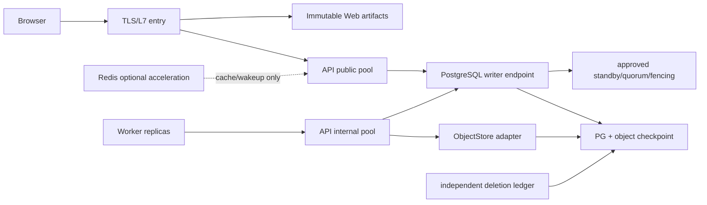

# FlowVerse V1 技术方案反方评审、整改路线与自我评估

## 0. 状态、口径与结论

| 项 | 结论 |
|---|---|
| Review window | 2026-08-14～2026-08-16 |
| Document status | `REVIEWED / ADVISORY / IN_REVIEW` |
| Authority | 本文不批准产品范围、依赖、Schema、API、生产拓扑、SLO、预算或 ADR，也不授权业务实现 |
| Review method | 以当前仓库源码、锁文件、部署配置、工程注册表和 Proposed 详细设计为证据做反方审查 |
| Runtime incident P0 | 0；当前不是已放行生产系统，因此不存在已发生的生产 P0 事故 |
| Production release decision | **BLOCKED**；如果把当前 Bootstrap 当业务生产系统发布，该发布决定本身应视为 P0 |
| Proposed design P0 | 0；未发现必须推翻三服务、PostgreSQL authority、ObjectStore port 或 D/S/H 主方向的问题 |
| Initial proposed/current-transition P1 | 10；见第 3 节整改前快照 |
| Deep contract follow-up | P1-11～P1-18及第三轮执行/评测/删除合同组；均已写入Proposed文档，见3.2～3.3 |
| Current document-contract severity | P0=0，P1=0；只表示当前冻结稿未发现未关闭的高优先级内部矛盾 |
| Overall judgment | 方案方向合理、文档较完整，但当前实现仍是非业务诊断 Bootstrap；高可用、高性能、恢复与 Prompt 效果均无生产证据 |

本轮必须把三种状态分开：

1. **Implemented**：已经存在源码、配置或锁文件，并有对应 Bootstrap 证据。
2. **Configured but unused**：中间件能力已经部署或打包，但没有业务消费者。
3. **Proposed**：只存在于 PRD、UIUX、Prompt 或技术设计中，尚未获得实现与运行证据。

“四册详细设计内部 P0/P1 已收口”只表示文档合同相互可解释；它不表示业务系统、生产 HA、性能、恢复或 Prompt 已经实现。

## 1. 本轮证据范围

- 当前实现：[Architecture Baseline](ARCHITECTURE_BASELINE.md)、[Tech Stack](TECH_STACK.md)、`services/web`、`services/api`、`services/worker`、`deploy/server/middleware`。
- 详细方案：[Detailed Technical Design](V1_DETAILED_TECHNICAL_DESIGN.md)、[Service/Middleware/Operations](V1_SERVICE_MIDDLEWARE_AND_OPERATIONS_DESIGN.md)、[Data/API Contract](V1_DATA_AND_INTERFACE_CONTRACT_DESIGN.md)、[Frontend Design](V1_FRONTEND_TECHNICAL_DESIGN.md)。
- 高层方案与预算：[Technical Solution Proposal](V1_TECHNICAL_SOLUTION_PROPOSAL.md)、[Reliability Budget](RELIABILITY_BUDGET.md)、[Performance Budget](PERFORMANCE_BUDGET.md)。
- 产品与交付：`../product/`、`../uiux/`、`../tasks/V1_IMPLEMENTATION_PLAN.md`、`../ai/SYSTEM_DECISION_PROMPTS.md`。
- 决策状态：`../intake/V1_PACKAGE_INTAKE.md`、`../governance/EVIDENCE_POLICY.md`、`../decisions/`。

没有把外部 UI 图片、健康检查、容器 `healthy`、架构图、副本设想或一次构建结果当作生产能力证据。

## 2. 当前实现真相

| 能力 | 当前证据状态 | 反方结论 |
|---|---|---|
| Web | React/Vite 诊断页，只请求 `/api/v1/system/chain`；无产品 Router、业务页面、表单、编辑器或 E2E | 只能证明浏览器到诊断链可连通，V1.0 用户面实际实现为 0 |
| API | FastAPI 健康、依赖和 system chain；八个业务模块只有边界声明 | 无 auth/session/CSRF、业务 REST/SSE、repository 或正式命令 |
| Worker | 健康与 internal diagnostic status；`ai_execution` 只有边界声明 | 无 durable job、claim/lease/fencing、provider call、文件处理或结果上报 |
| Migration | `0001_architecture_bootstrap` 不创建业务对象 | 物理业务表为 0；详细设计中的 103 个逻辑表不是 DDL |
| Public API | 只有 operational/diagnostic endpoint | 详细设计中的 107 行资源/命令目录不是已发布 OpenAPI |
| PostgreSQL | 18.4 单实例；50 连接、512 MiB shared buffers；API/Worker 仅 `SELECT 1` | 是当前唯一已接入的状态能力，但不是已验证的业务 authority/HA 集群 |
| pgvector | 0.8.5 二进制能力，未 `CREATE EXTENSION` | 小说 V1 不应启用；不是 RAG 已实现证据 |
| TimescaleDB | 2.28.3 OSS 二进制并被 preload，未 `CREATE EXTENSION` | 当前无小说业务消费者，却占用 preload/background-worker 预算 |
| Redis | 8.8.0 单实例，AOF `everysec`、512 MiB、`noeviction`；无消费者 | 目前不是缓存、队列、session 或幂等 authority；停用不应影响业务，因为业务尚未接入 |
| MinIO | 单实例、单 volume、root bootstrap；无业务 bucket/account/adapter；live auth 曾返回 `InvalidAccessKeyId` | 不能用于 V1.0 参考、导出、正式对象或恢复链 |
| Observability | structlog/OTel SDK 与本地关联信息；无 exporter/backend/alert/on-call | 无法证明 SLO、容量、故障切换或性能回归 |
| Deployment | 本地原生三服务 + 单主机三中间件 Compose | 无应用生产平台、LB/TLS/DNS、CI/CD、跨故障域部署或回滚证据 |
| HA/recovery/performance | 设计和预算条目存在 | 运行证据均为 `Unverified`；唯一 Confirmed 可用性数字仍是内部 MVP 99% 目标 |

## 3. 挑刺结果：P1 整改前问题快照与修复要求

除 P1-01 已按当前批准状态更新外，P1-02～P1-10 的“问题/风险”记录的是 2026-08-15 completion pass 之前的审查快照，用于保留为什么需要整改的证据，不应再单独当作 2026-08-16 当前事实。各项最新文档合同状态以 3.1 为准；`Contract added` 只关闭文字合同缺口，选择、批准、实现和运行证据仍未闭合。

### P1-01：批准门未闭合，详细设计不可直接转成业务代码

**问题**：`FV1-ROADMAP-REVIEW` 与 `FV1-DOCUMENT-COMPLETION` 仍为 `IN_REVIEW`。ADR-0011～0024、0029、0030 文件和 Decision Log 现已存在，但全部仍为 `Proposed`、未被用户接受；它们只能提供可审查选项，不能授权业务模块、Schema、API、auth、异步、对象、provider 或生产实现。

**风险**：开发者会在没有唯一 owner、兼容策略、依赖版本和测试命令的情况下，从 2,000 多行设计中自行选择答案。

**修复**：先整体批准当前产品/UIUX/Prompt/技术 change set，再只接受 H0 实际适用的 ADR 和其中尚待选择的选项；不能因为文件已创建就把整段编号范围视为已通过。每份适用 ADR 必须有 owner、替代方案、回退、合同和验证门，H1/H2 只在首次到期时另行接受。

### P1-02：99% 内部 MVP 与 Proposed 99.9% HA 被混成一个门

**问题**：当前产品只确认内部 MVP 99%；99.9%、多故障域、第三票、N-1 仍是 Proposed。如果把全套 HA 当 V1.0 单用户验证的先决条件，会把产品纵切片变成基础设施项目；如果全部延后，又会漏掉正式数据耐久、恢复和删除防复活。

**修复**：拆成两道门。

- **Data-safety gate，V1.0 必须**：durable write、备份/PITR、对象备份、恢复演练、删除防复活、明确降级、审计和可恢复性。
- **Availability gate，按批准服务等级到期**：多故障域、自动选主、N-1 容量、99.9% error budget、自动扩缩与更高等级值班。

不能用“暂不做 99.9%”降低正式事实的 RPO 或删除语义。

### P1-03：PostgreSQL 的“主库 + 单同步备库 + 第三票”没有闭合 N-1 写语义

**问题**：第三票能降低脑裂风险，却不承载数据。丢失唯一同步 standby 后，系统必须在“停止正式写入”和“退化为单副本写入并接受新 RPO”之间选择；当前方案没有冻结这个选择。

**修复选项**：

1. 需要在一个故障域失效后继续正式写：采用三个数据承载节点跨三个故障域、同步 quorum `ANY 1`，并有独立可靠 DCS/fencing；或采用经过等价语义证明的托管 PostgreSQL。
2. 接受数据优先于写可用：保留两数据副本 + witness，但失去同步副本时正式写 `fail closed`，只读/草稿按批准降级，冻结修复时限和 error-budget 处理。

无论选哪种，必须用故障演练证明 writer endpoint、旧 primary fencing、提交语义、复制延迟和恢复后的唯一性。

### P1-04：MinIO/ObjectStore 当前不可执行，且生产生命周期风险高

**问题**：live auth 未通过；没有应用账号、bucket、TLS、加密、版本、生命周期、备份、恢复或 adapter contract。当前 MinIO 是单节点、单卷，并且仓库文档已记录所选上游项目归档/维护风险。

**风险**：参考、截图证据、执行 delivery、导出和跨存储恢复都会在首个业务对象处阻断；继续使用 root account 会扩大故障与安全半径。

**修复**：

- H0 首个对象切片前，先修正 live auth；创建最小权限应用 identity 和按用途隔离的对象类别；冻结 S3 子集、locator、quarantine→verify→commit、checksum、直传 finalize、删除和短时 grant。
- 为当前单机开发环境保留 MinIO adapter；生产需在“受维护的分布式 MinIO/兼容实现”和“托管 S3-compatible 服务”之间评审生命周期、许可、故障域、RPO、成本和退出路径。
- 不先做多云 SDK；只实现窄 `ObjectStore` port 和 adapter contract suite。

### P1-05：跨存储恢复与删除方向正确，但所有关键产品仍 Unknown

**问题**：PG+ObjectStore checkpoint、独立 deletion ledger、ledger-first 三态已经设计正确；但 ledger/WORM 产品、凭据、签名、位置、checkpoint 分页/频率、对象 HA、备份工具、reconciliation owner 和完整 restore drill 都不存在。并发写入持续发生时，当前也没有定义如何把某个 PG timeline/LSN、当时全部 committed object 与 ledger high-watermark 组成一个一致 logical cut；单纯枚举对象并事后验 hash 不能证明它们属于同一恢复点。

**修复**：在任何正式对象引用或删除功能放行前，选择独立于 PG restore timeline 的 durable ledger。以短事务创建 checkpoint epoch，并冻结 PG MVCC snapshot 或 append-only object-reference watermark/outbox；对象备份按固定边界生成分片 manifest/Merkle root，再锁定并验证 ledger high-watermark、Schema/config/artifact，最后原子地把 checkpoint 从 `BUILDING` 推进到 `RECOVERABLE`。任何 gap、超窗或备份未覆盖都不能放行。以 PRD 最大对象边界完成并发写、分页跨页、构建中崩溃和破坏性隔离环境 restore 演练，保存原始 RTO/RPO 结果。

### P1-06：Worker 控制面存在瓶颈、依赖环迁移和付费结果丢失窗口

**问题**：目标 Worker→API pull 能保持业务 owner 单一，但 API+PG writer 会成为所有异步任务的控制面。claim cadence、退避/jitter、空轮询、workload 公平性、internal pool/semaphore 和 PG 连接预算未冻结。当前又保留 API→Worker diagnostic 与 Worker→PG probe；如果直接叠加目标合同，会形成双向生产依赖和越权 DB 访问。

Provider 返回后、API 接收前还依赖尚未选型的 DeliveryStore；Worker 丢失可能留下“费用发生、输出丢失”。

**修复**：

- 异步 ADR 明确 retire/隔离 API→Worker 诊断链；生产 Worker 不持有业务 DB repository/credential，只用 workload identity 访问 `/internal/v1`。
- 冻结有界 long-poll 或 exponential backoff+jitter、每类配额、公平调度、internal/public 隔离池和饱和拒绝。
- 每个真实付费调用前提供跨 Worker 故障耐久的加密 DeliveryStore，定义容量、保留、ack、GC、满载和 reconciliation。
- 只有 queue age、pool wait、lock 或 wake-up 成本的测量证明需要时，才以 Redis wake-up 或 broker 优化；PG 仍保持 single claim owner、outbox/dedupe 语义。

### P1-07：Prompt revoke 与 provider call 之间缺原子不可逆点

**问题**：设计要求严重 revoke 阻断尚未开始的步骤，但 claim 与实际 provider call 之间没有 JIT call-start authority。revoke/lease loss 可能发生在这个窗口，系统无法权威判断外部副作用是否开始。

**修复**：增加每 step 的原子 call-start intent/authorization：锁定 job+attempt+lease+step，重验 activation/evaluation/policy/budget/input，持久化 provider idempotency key 和 `started` marker，再返回短时 call token。过点前 revoke 可阻断；过点后进入 in-flight/unknown-outcome 流程。首个真实 provider call 前做 crash-point 测试。

### P1-08：性能门有目标，没有可执行 benchmark

**问题**：普通交互 P95≤2s、参考处理≤3m 等目标存在，但环境、冷热状态、夹具、并发、样本、命令、噪声和回归阈值仍 Unknown。PRD 已确认单任务 20 文件、10 MB/文件、50 万字符/文件、200 万字符/任务和 300 页 PDF，却没有成为 H0 benchmark profile。

**修复**：业务编码前先批准 H0 profile：

- PRD 默认创作范围与各项批准容量上限；短/目标/上限三个数据层。
- cold/warm、单用户+管理员、保存/查询/SSE/队列/对象/参考处理路径。
- 固定环境、build/config、缓存状态、采样/窗口、原始结果存储和 regression threshold。
- 先测量 PG query/lock/pool、API handler、Worker queue/step、ObjectStore 和浏览器长任务，再选择优化手段。

### P1-09：公共降级协议不足，会导致误读和重试风暴

**问题**：错误 envelope 有稳定 code，但缺少机器可判的 `degradationMode`、`affectedCapabilities`、`dataFreshness/asOf`、`retryable`、`retryAfter` 和 `lastKnownGoodRef`。前端对 GET 的自动 retry 如果在过载/切换期间无界，会放大故障。

**修复**：OpenAPI 冻结前补统一 degradation/freshness/retry contract；429/503 同步 HTTP `Retry-After`；按“草稿保存、正式写、只读查询、候选 AI、对象下载”逐类定义 fail-open/fail-closed。Web 只执行服务端允许的有界重试，并明确告诉用户工作是否保存、数据是否陈旧、下一步是什么。

### P1-10：实现面过宽，Contract Bootstrap 本身仍不可执行

**问题**：详细数据册有 103 个逻辑表和 107 行 endpoint catalog；它们对全路线梳理有价值，但不适合一次性成为首个 migration/OpenAPI。当前 architecture checker 又只允许 Bootstrap 的九个边界，而目标增加 `execution_control`、`document_processing`、`export_generation` 等实现模块。

**修复**：为 H0/H1/H2 分别生成“物理实现 allowlist”：仅列本版到期的表、endpoint、event、UI route、Prompt family、migration 和 test。先原子批准并更新 Architecture Baseline、ADR、checker 和 checker self-test，再建立新模块；不以空目录预建未来 V1.1/V1.2/V2 领域。

### 3.1 2026-08-16 文档合同闭环登记

下表只表示相应修复已经写入同一组 `IN_REVIEW / Proposed` 文档；它不表示用户已接受决策、业务代码已实现或运行验收已通过。每项的实现证据仍为 `Unverified`。

| Finding | 文档合同状态 | 同源落点 | 仍阻断实现/上线的证据 |
|---|---|---|---|
| P1-01 批准门 | Contract added | intake/evidence policy、ADR-0011～0024/0029/0030、实施计划 | 用户整体批准、适用 ADR Accepted、依赖/API/Schema/auth 精确冻结 |
| P1-02 两层可用性门 | Contract added | PRD 增补、Product Brief、实施计划、Reliability Budget | `DataSafetyGate` 实测；仅在 UD-AVL-01 选择后才启用 `AvailabilityGate` |
| P1-03 PG N-1 写语义 | Options closed, choice pending | ADR-0022、总体/服务方案、Architecture Baseline | 用户在 C1 三数据节点与 C2 单同步备节点正式写 fail-closed 之间选择并演练 |
| P1-04 ObjectStore | Contract added | ADR-0015、服务/数据册、H0 object gate | 修复 live auth；批准 SDK/identity/bucket/TLS/backup；contract/restore/failure tests |
| P1-05 跨存储恢复 | Options closed, choice pending | ADR-0018、服务/数据册、Reliability Budget | 用户选择 B1 epoch+MVCC 或 B2 object-reference watermark；PITR/manifest/ledger/restore drill |
| P1-06 Worker/结果耐久 | Contract added | ADR-0013、服务/数据册 | internal pool/配额/退避参数、DeliveryStore 产品与容量、outage/crash/reconcile 演练 |
| P1-07 provider 不可逆边界 | Contract added | ADR-0029、系统 Prompt、服务/数据册 | 首个真实 provider 前完成 call-start crash-point、revoke、idempotency/outcome-unknown 测试 |
| P1-08 性能基准 | Partial contract added | PRD 增补、实施计划、Performance Budget、ADR-0023 | 固定容量输入已登记；环境、冷/热、并发、样本、命令、逐路径阈值与 raw result 待批准/执行 |
| P1-09 降级协议 | Contract added | UIUX degradation spec、AC-26A/B/C、前端/数据册、ADR-0012 | OpenAPI/generated client、429/503/receipt/LKG E2E、a11y/视觉证据 |
| P1-10 物理切片 | Contract added | H0/H1/H2 route/table/API allowlist、ADR-0011、实施计划 | 每版生成并审批机器可检查 manifest；migration/OpenAPI/代码仍不存在 |

因此本轮反方审查在**文档合同层**为 `P0=0，P1=0`；在**实现与生产放行层**上述十项全部保持未完成证据门，Gate A 继续 `Blocked`。

### 3.2 2026-08-16 深层合同复审闭环

在第一轮十项整改后，又以执行失败点和物理可生成性为标准做第二轮挑刺。下表仍只表示 `IN_REVIEW / Proposed` 文档合同已补，不代表实现或测试通过。

| Finding | 文档整改 | 仍未完成的实施证据 |
|---|---|---|
| P1-11 非 AI job 被迫伪造 execution lineage | `durable_job/jobContext` 改为判别式合同：AI 固定 execution/attempt/binding/step，文档处理固定 object version，导出固定 export request，maintenance 仅固定 `DELETION_RECONCILIATION+deletionRequest` 或 `RECOVERY_CHECKPOINT_BUILD+recoveryCheckpoint` | migration、Pydantic/OpenAPI/internal contract、四类 handler；unknown maintenance subtype/target 及 registration/claim/report 错配、旧 fencing 均拒绝的测试 |
| P1-12 provider 幂等键只存 hash、崩溃后不可恢复 | JIT intent 冻结 provider capability/version 及确定性 key derivation 版本/作用域或加密 key/ref；同 intent/hash 只返回同一 exact key，不支持时保持 unknown | provider capability contract、secret/KMS 方案、响应丢失/重领/重复副作用测试 |
| P1-13 DeliveryStore 只在 API 不可用时使用 | 所有 Worker 结果首次 report 前强制 `RESULT_BUFFERED`，API receipt 后才 ack/GC；API 当前可达也不能跳过 | 跨 Worker 耐久介质、容量/保留/满载/损坏策略及 provider-return→Worker-loss→API-recovery 演练 |
| P1-14 逐版 allowlist 漏 internal 控制面 | 第7.2节编号 `INT-001–INT-010`；H0一次建立物理路径，H1/H2只扩获批 jobType/family/schema/capability overlay；production H0退役API→Worker Bootstrap诊断 | machine-readable release manifest、router/registration/claim/report deny tests、生产依赖图 |
| P1-15 同名 semantic envelope 存在多种字段形状 | `SYSTEM_DECISION_PROMPTS.md` 冻结唯一 canonical `semantic-candidate-envelope/v1`完整字段集；UI 使用不同名的脱敏 view | JSON Schema、canonical serialization/hash、持久化/投影/生成客户端合同测试 |
| P1-16 recovery checkpoint 既整行不可变又需状态推进 | root 改为受控 `BUILDING→VERIFYING→RECOVERABLE`，失败终态`FAILED`；cut identity先冻结，终态全不可变且失败重建新版本 | 物理约束/transition command、并发分页/Merkle/崩溃和 restore gate 测试 |
| P1-17 总结把未决PG拓扑写成单一安全建议 | 摘要与各册都明确 C1三data-bearing同步quorum或C2唯一同步standby丢失后formal-write fail-closed；第三票不冒充数据副本 | 用户选择C1/C2、拓扑/容量/监控、failover/fencing/N-1原始证据；AvailabilityGate未适用时不得宣称HA |
| P1-18 把目标 adapter/job 写成当前实现 | 扩展矩阵拆成 Confirmed current/conformance、Proposed初始业务目标、Future；明确当前只有诊断Bootstrap、Redis无业务consumer、MinIO auth失败且对象capability disabled | 依赖/adapter/Schema/handler/生产平台逐项批准、实现与测试 |

第二轮整改后的独立只读终审结果为文档合同层 `P0=0，P1=0`；该结论只表示当前同步稿未再发现会导致错误实现/验收的高优先级矛盾，绝不能把“合同闭合”提升为业务实现、Prompt有效、HA/性能达标或生产放行。

### 3.3 第三轮执行失败点与 Prompt 效果链复审

第三轮不增加业务范围，专门从“崩溃恰好发生在两次提交之间”和“首版没有旧 Prompt 可对照”两个角度检查物理可实现性。下表中的合同仍全部是 `Proposed / Unverified`。

| 合同组 | 已关闭的文档歧义 | 仍需的实现证据 |
|---|---|---|
| Prompt 评测与晋升 | BUSINESS/EVALUATION、OFFLINE/SHADOW、TARGET/JUDGE、CANDIDATE/CONTROL、每模型 lane 和 activation key 全部判别；DIRECT 只作补充且不能晋升；PROMPT_ONLY、FACTORIAL、BASELINE_GATE 使用不同证据集合。首版 HUMAN/NO_AI control 由不可变 typed-baseline artifact+人工批准 receipt 表示，不伪造 provider lane；API finalizer 才能产生 EligibilityAssessment | 精确 JSON Schema/DDL、Golden/hidden set、rubric/阈值、同模型 paired fixtures、typed baseline provenance、人标/judge 校准、Shadow consent、Pilot/Canary 与 no-AI/LKG 回退演练 |
| Provider 不可逆点与多模型 lineage | 每个模型 lane 独立 Preview/ExecutionBinding/Attempt/Job；JIT 冻结真实 resolved input、authority、exact-key strategy 和 `CALL_START_COMMITTED`；JUDGE binding 只冻结 dependency selector，实际 TARGET/baseline refs 进入 ModelCall | provider capability/version contract、exact-key/KMS、并发 lane/retry/fallback、revoke/lease-loss/响应丢失 crash-point 测试 |
| DeliveryStore 与删除交叉 | 所有 artifact result/failure 强制 write-through；record 以 job/context/reportKey 唯一；支持 DELIVERY_RECOVERY、DELETION_DISPOSITION、result receipt 找回。每个写 grant 先有 grant-intent receipt；无 payload 只能在逐 locator 不存在/secure erase + 固定 HWM 无记录后写 NO_PAYLOAD proof，不能只靠 index 未命中 | 跨 Worker 耐久介质、原子/不可见 commit 或 orphan recovery、容量/满载/损坏、payload-before-index、late provider result、删除 barrier 与 cleanup 完整故障演练 |
| 路由与后台作业物理清单 | 累计目录固定为 103 logical tables、107 Public rows、10 business Internal rows、5 operational health rows；四类 job 为 AI/document/export/maintenance，maintenance 仅两个封闭 subtype。production 成对退役 Web Check、public chain 与 internal diagnostic status | 机器生成 release manifest、router/OpenAPI/internal Schema、unknown job/subtype deny、public/internal readiness 隔离及 production dependency graph 测试 |

第三轮独立只读终审同样得到文档合同层 `P0=0，P1=0`。实现、HA、性能、恢复、Prompt 效果和视觉验收仍没有因此变为 Passed。

## 4. 三类中间件的目标用法

### 4.1 PostgreSQL：唯一权威事实与耐久作业

**现在保留**：单 writer、模块 owner、不可变版本、revision/idempotency/receipt、durable job/lease/fencing 方向。

**H0 必须补齐**：

- API 是唯一业务 DB 访问者；Worker 不直接访问业务表。
- 根据 PostgreSQL 当前 `max_connections=50` 冻结总连接预算：预留运维/migration/monitor，再在 API public/internal 实例和必要 exporter 之间分配；当前 SQLAlchemy probe 的默认 pool 不能照搬业务 pool。
- 设置并测试 statement/lock/idle-in-transaction timeout；对正式命令使用短事务、唯一约束和 D2；长文件/模型调用绝不占事务。
- migrations 每版单 head、expand/backfill/contract；慢查询以真实 `EXPLAIN (ANALYZE, BUFFERS)` 和写放大证据决定索引。
- 先完成 backup/PITR/restore；读副本只在读负载证据出现后承载允许陈旧的查询，正式确认、权限、receipt 和 manifest 仍走 writer。

**暂不启用**：小说 V1 不创建 pgvector/TimescaleDB extension。生产 V1 profile 应评审是否移除 Timescale preload/background workers；当前获批开发 Compose 不在本轮静默修改。只有 V2 数据规模与查询证明普通 PG 分区不足后才启用 TimescaleDB；只有真实检索评测证明全文/结构检索不足后才启用 pgvector。

### 4.2 Redis：可丢失加速层，不是业务真相

**当前结论**：没有业务消费者，保持 N/A 是正确的；不要为了“已经部署”而接入。

**允许的未来角色**：短 TTL query cache、SSE wake-up、共享 rate-limit/ephemeral coordination。每个角色分别批准 key schema、TTL、容量、故障降级和数据分类。

**禁止角色**：正式状态、job authority、幂等 receipt、费用 ledger、Prompt activation 或对象 locator。

**扩展触发器**：

| 证据 | 才允许的变化 |
|---|---|
| 相同 PG 读查询占主要延迟且有稳定失效语义 | cache-aside；Redis 故障回源 PG |
| 多 API 实例下 SSE/通知轮询消耗显著 | Redis wake-up；事件权威仍在 PG |
| 安全评审要求跨实例共享限流 | 独立限流 role，失败行为由风险等级决定 |
| 内存/吞吐或角色策略互相冲突 | 拆实例/托管 HA；不要在一个 `noeviction+AOF` 实例混合 cache 与 coordination |
| 单节点故障已进入批准 SLO 包络 | Sentinel/托管 primary-replica；Cluster 只在分片容量证据出现后 |

### 4.3 MinIO/ObjectStore：二进制数据面，不是正文事实源

PG 保存 logical object、version、hash、rights、state 和 reference；ObjectStore 只保存不可变字节。浏览器只能拿短时 grant，不能构造 bucket/key；只有 `COMMITTED` 对象可进入正式 snapshot/execution/export manifest。

业务启用顺序：auth 修复 → 最小权限 identity → TLS/加密 → quarantine/verify/commit → hash/contract tests → backup/restore → failure drill → 生产 HA 选型。当前单机 MinIO 只适合作为开发 adapter，不可证明生产 durability。

## 5. 三服务的高可用与性能边界

- Web：content-hashed immutable artifact；切换和回退原子化。业务 Web 依赖批准前，当前诊断 bundle 不能作为产品性能基线。
- API：至少把 public/internal admission、connection/semaphore、timeout 和 readiness 分开；依赖降级不让 `/live` 退出，writer/quorum capability 只影响需要它的动作。
- Worker：多副本依靠 PG durable job + lease/fencing，不靠 Redis durable queue；provider/file/export workload class 分配独立额度，慢任务不拖垮交互。
- 所有服务：先有 exporter/backend、低基数指标、告警 owner、runbook 和 trace correlation，再谈自动扩缩或 99.9%。

## 6. 分阶段整改路线

### Gate R0：批准与最小物理切片

1. 用户冻结 V1.0 服务等级、故障包络、正式数据 RPO、对象存储生产策略和运维 owner。
2. 接受当前切片适用 ADR；补齐实际需要而非编号占位的业务/API/auth/object/async/deployment/performance ADR。
3. 生成 H0 allowlist 与 traceability manifest；批准依赖精确版本和 Confirmed+Available 命令。
4. 冻结 H0 benchmark、公共 degradation contract 和生产平台候选。

### Gate R1：V1.0 最小纵切片

按 identity/session → Shell/CreationBaseline → reference/ObjectStore → content/review/formal snapshot → 最小 AI execution 顺序实现。每一步同时交付 migration、OpenAPI/generated client、owner contract、unit/integration/E2E、audit 和回退，不一次创建 103 表/107 endpoint。

### Gate R2：数据安全与可观测

实现 PG backup/PITR、ObjectStore backup、checkpoint、independent deletion ledger、restore reconciliation；落 exporter/backend/alerts/on-call 和容量仪表。完成 auth/object/AI 失败、未知结果、删除 pre/post-intent 和 restore fail-closed 演练。

### Gate R3：生产 HA

批准并部署跨故障域 Web/API/Worker、PG 数据副本/quorum/fencing 和高耐久 ObjectStore；Redis 只有在已有业务角色时才进入自身 HA。完成单实例、单故障域、旧 primary、对象节点、API internal pool 和 Worker crash 的 N-1/故障测试。

### Gate R4：性能证明

在固定 build/config/data/profile 下跑普通交互、保存、参考处理、对象、AI 状态、队列、SSE、soak 和 N-1；报告 P50/P95/P99、error、queue age、pool/lock wait、CPU/memory/IO、成本和原始样本。只有瓶颈证据出现后才启用缓存、读副本、broker、分区、vector 或 time-series 优化。

### Gate R5：累计版本扩展

V1.1、V1.2 各自增加到期表/API/UI/Prompt/workload，回归前版并重复数据安全、性能和降级门。V2 金融继续保持独立 PRD/AC/UIUX/许可/合规门，不预建金融表、路由或扩展。

## 7. 明确禁止当前预建的能力

- Kafka/通用 broker、微服务拆分、服务网格、多区域 active-active。
- Redis 业务队列、正式 session/fact/receipt authority。
- PostgreSQL 分片、无证据读副本、小说表分区、Timescale hypertable/continuous aggregate。
- pgvector embedding/index、通用 RAG 平台、湖仓或通用数据连接器。
- 分布式 Workflow Builder、任意 Agent/Prompt 编辑或 DAG。
- 一次性实现全部 103 个逻辑表和 107 行 endpoint catalog。

## 8. 自我评估

以下是反方 reviewer 的咨询性评分，不是获批 acceptance rubric，也不能转成 Passed：

| 维度 | 设计自评 | 当前实现自评 | 说明 |
|---|---:|---:|---|
| 产品/技术一致性 | 4/5 | 1/5 | 分版、D/S/H 和 owner 基本一致；业务面尚未实现 |
| 可扩展性 | 4/5 | 2/5 | 模块化单体、ports、触发式中间件合理；合同尚未变成 executable code |
| 数据正确性/可恢复性 | 3.5/5 | 1/5 | checkpoint/ledger/fencing 方向强；backup/restore/ledger 全未实现 |
| 高可用 | 3/5 | 0.5/5 | 单区多域方向合理，但 PG N-1 写语义未选；当前全部单机 |
| 性能设计 | 3.5/5 | 1/5 | 已冻结 H0 容量输入与短/目标/上限分层；环境、工具、逐路径阈值和业务测量仍缺失 |
| 运维可持续性 | 2.5/5 | 1/5 | runbook 思路存在；平台、监控、值班、MinIO 生命周期均未闭合 |
| 实施可控性 | 3.5/5 | 1/5 | 已补 H0/H1/H2 精确 allowlist 与横切门；尚未生成获批的 migration/OpenAPI/代码 manifest |
| Prompt 效果保障 | 4/5 | 0/5 | 治理设计完整；无 family 评测、模型运行或线上证据 |

**方案总体**：`B / Conditional`。逐版物理切片与 PG/ObjectStore/Worker 不可逆边界已形成 Proposed 合同；批准、具体产品选型和实测证据仍是条件。

**当前生产就绪度**：`D / Blocked`。只能称“非业务 Bootstrap 可诊断、三中间件单机能力已配置”，不能称“V1 已实现、高可用、高性能或可生产”。

## 9. 最终建议与用户需冻结的决策

最优先不是增加中间件，而是依次决定：

1. V1.0 是 99% 内部验证，还是需要 99.9% 的外部生产承诺；维护窗口和 error-budget 如何计算。
2. 正式数据“不得丢失”适用到进程、节点、故障域还是区域；失去同步副本时是停正式写还是退化写。
3. PostgreSQL 采用托管 HA 还是自运维三数据节点/DCS/fencing；团队是否有 7×24 运维能力。
4. 生产 ObjectStore 继续自运维兼容实现还是使用托管 S3-compatible；MinIO 维护/许可/退出由谁承担。
5. H0 的并发、数据层、峰值、AI backlog、对象增长和保留期；据此批准 benchmark 与容量，不从容器 limits 反推业务容量。
6. 监控 backend、告警渠道、on-call owner、备份工具、恢复演练环境和证据保留位置。

在这些决策未冻结前，推荐继续用现有 PostgreSQL/Redis/MinIO 做开发诊断，但只把 PostgreSQL 和最小 ObjectStore contract 接入 H0；Redis 保持非业务能力，pgvector/TimescaleDB 保持未启用。

## 10. Review 验证边界

原始反方审查不修改业务源码；2026-08-16 的 completion pass 只同步仓库内 PRD 增补、UIUX/验收、技术设计、预算、实施计划、治理登记和 Proposed ADR。它没有修改业务源码、manifest/lock、部署、中间件配置、数据库、外部 PRD 或 UIUX ZIP。没有运行尚不存在的业务、性能、HA、failover 或 restore 测试；对应结果保持 `Unverified`。文档结构/链接与现有仓库架构检查记录在 `V1_TECHNICAL_SOLUTION_EVALUATION.md`，不能替代产品验证。
